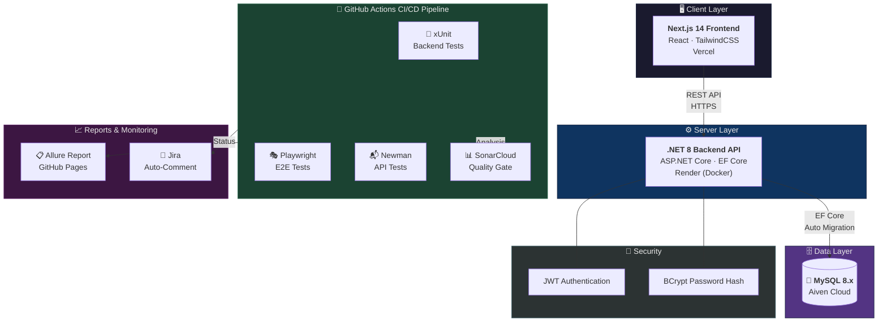
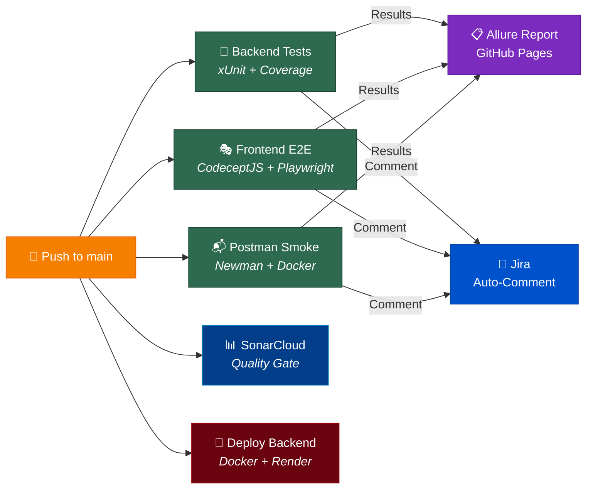

# ♻️ KCPM — Waste Recycling Platform

> **Kiểm Chứng Phần Mềm** | UIT Team 36 | Đại học Công nghệ Thông tin — ĐHQG TP.HCM

[](https://github.com/chi-trung/KCPM/actions/workflows/backend-tests.yml)
[](https://github.com/chi-trung/KCPM/actions/workflows/frontend-e2e.yml)
[](https://github.com/chi-trung/KCPM/actions/workflows/postman-smoke.yml)
[](https://github.com/chi-trung/KCPM/actions/workflows/allure-gh-pages.yml)
[](https://github.com/chi-trung/KCPM/actions/workflows/sonar.yml)
[](https://github.com/chi-trung/KCPM/actions/workflows/deploy-server.yml)

[](https://sonarcloud.io/summary/new_code?id=chi-trung_KCPM)
[](https://sonarcloud.io/summary/new_code?id=chi-trung_KCPM)
[](https://sonarcloud.io/summary/new_code?id=chi-trung_KCPM)
[](https://sonarcloud.io/summary/new_code?id=chi-trung_KCPM)

[](https://github.com/chi-trung/KCPM/actions/workflows/backend-tests.yml)
[](https://github.com/chi-trung/KCPM/actions/workflows/backend-tests.yml)
[](https://github.com/chi-trung/KCPM/actions/workflows/backend-tests.yml)

---

## 📖 Giới thiệu

**Waste Recycling Platform** là hệ thống quản lý thu gom rác thải tái chế, kết nối **người dân**, **doanh nghiệp thu gom**, và **cơ quan quản lý**. Dự án được xây dựng trong khuôn khổ môn **Kiểm Chứng Phần Mềm** nhằm áp dụng các quy trình kiểm thử phần mềm chuyên nghiệp.

### Chức năng chính

| Vai trò | Chức năng |
|---------|-----------|
| 🟢 **Citizen** | Tạo báo cáo rác (GPS, ảnh, phân loại), theo dõi trạng thái, đổi điểm thưởng |
| 🔵 **Enterprise** | Quản lý đội thu gom, phân công công việc, xem thống kê |
| 🟠 **Collector** | Nhận và cập nhật trạng thái công việc thu gom |
| 🔴 **Admin** | Quản lý người dùng, duyệt doanh nghiệp, xử lý khiếu nại |

---

## 🌐 Live Demo

| Component | URL | Ghi chú |
|-----------|-----|---------|
| **🖥️ Frontend** | [kcpm.vercel.app](https://kcpm.vercel.app) | Next.js trên Vercel |
| **⚙️ Backend API** | [kcpm-backend.onrender.com](https://kcpm-backend.onrender.com/api/health) | .NET 8 trên Render |
| **📖 Swagger UI** | [Swagger](https://kcpm-backend.onrender.com/swagger) | API Documentation |

> ⚠️ **Backend chạy trên Render Free Tier** — server tự ngủ sau 15 phút không có request.
> Lần đầu truy cập sẽ mất **30-60 giây** để khởi động (cold start). Chỉ cần đợi!

### 🔑 Tài khoản test

Tất cả tài khoản dùng password: `password`

| Email | Role | Tên |
|-------|------|-----|
| `admin@gmail.com` | Admin | System Administrator |
| `nguyenvana@gmail.com` | Citizen | Nguyễn Văn A |
| `lethib@gmail.com` | Citizen | Lê Thị B |
| `greenlife@gmail.com` | Enterprise | Green Life CEO |
| `collector1@gmail.com` | Collector | Phạm Minh Dũng |

👉 Xem đầy đủ: [`docs/TEST_ACCOUNTS.md`](docs/TEST_ACCOUNTS.md)

---

## 📊 Test Reports

| Report | URL |
|--------|-----|
| **Allure Report (Live)** | [chi-trung.github.io/KCPM/report-main](https://chi-trung.github.io/KCPM/report-main/) |
| **Jira Board** | [ut-team-36.atlassian.net](https://ut-team-36.atlassian.net/jira/software/projects/KIEM/boards/3) |
| **SonarCloud** | [sonarcloud.io/chi-trung_KCPM](https://sonarcloud.io/summary/overall?id=chi-trung_KCPM) |

---

## 🏗️ Tech Stack

| Layer | Technology |
|-------|-----------| 
| **Backend** | ASP.NET Core 8, Entity Framework Core, MySQL (Aiven) |
| **Frontend** | Next.js 14, React, Vercel |
| **Database** | MySQL 8.x (Aiven Cloud) |
| **E2E Tests** | CodeceptJS + Playwright |
| **API Tests** | Postman + Newman |
| **Unit Tests** | xUnit + Moq |
| **CI/CD** | GitHub Actions (11 workflows) |
| **Test Report** | Allure (auto-deploy to GitHub Pages) |
| **Code Quality** | SonarCloud (Quality Gate) |
| **Issue Tracking** | Jira (auto-logged from CI) |
| **Hosting** | Vercel (Frontend) + Render (Backend) + Aiven (Database) |

---

## 🏛️ Kiến trúc hệ thống



---

## 🚀 CI/CD Pipeline

11 GitHub Actions workflows tự động:



---

## 👥 Team

### Phân công theo Sprint & Jira

| Thành viên | Vai trò | Sprint 1 | Sprint 2 | Sprint 3 |
|-----------|---------|----------|----------|----------|
| **Nguyễn Chí Trung** | Team Lead, CI/CD, Architect | KIEM-3, KIEM-4, KIEM-41, KIEM-42, KIEM-43 | KIEM-14, KIEM-16, KIEM-17, KIEM-19, KIEM-45, KIEM-51 | KIEM-55, KIEM-59, KIEM-65 |
| **Minh Phụng** | Backend Testing, Reports | KIEM-5, KIEM-44 | KIEM-15, KIEM-20, KIEM-46, KIEM-52, KIEM-54 | KIEM-32, KIEM-33, KIEM-38, KIEM-63, KIEM-64, KIEM-66 |
| **Nguyễn Hoàng Phụng** | Security, Notifications | KIEM-6, KIEM-12 | KIEM-21 | KIEM-31, KIEM-34, KIEM-39, KIEM-70 |
| **11A6_03_Đăng** | Admin, Analytics | KIEM-8, KIEM-9 | KIEM-49 | KIEM-61 |
| **Thanh Duy** | Complaints, CollectorTask | KIEM-7, KIEM-10 | KIEM-18, KIEM-22, KIEM-47, KIEM-48, KIEM-53 | KIEM-35, KIEM-56, KIEM-60, KIEM-67, KIEM-68, KIEM-69, KIEM-71 |

### Chi tiết phụ trách

| Thành viên | Module phụ trách | Loại test |
|-----------|-----------------|-----------|
| **Nguyễn Chí Trung** | Auth, Collector, Enterprise Collectors, WasteCategory, SignalR, Security & Role-based | Unit Tests (xUnit), E2E Tests, CI/CD Pipeline, SonarCloud, Deployment |
| **Minh Phụng** | Reports, File Upload, CollectorTask, Citizen + Search | Unit Tests (xUnit), Postman Collection, Security Hotspot fixes |
| **Nguyễn Hoàng Phụng** | Notifications, WasteCategory, Security & Role-based | Unit Tests (xUnit), SonarCloud Quality Gate fixes |
| **11A6_03_Đăng** | Admin Module, Analytics, Traceability Matrix | Unit Tests (xUnit), Manual Test Cases |
| **Thanh Duy** | Complaints, CollectionTask, AuditLog, Public Analytics | Unit Tests (xUnit), BVA Tests, Manual Test Cases (Excel) |

> 📌 **Tổng cộng 61+ Jira tasks** được chia đều cho 5 thành viên qua 3 sprints. Xem chi tiết trên [Jira Board](https://ut-team-36.atlassian.net/jira/software/projects/KIEM/boards/3).

---

## 🛠️ Cài đặt local

### Yêu cầu
- .NET 8 SDK
- Node.js 18+
- MySQL 8.x (hoặc Docker)

### Backend
```bash
cd Waste-Recycling-Platform/backend
dotnet restore
dotnet run --project src/WastePlatform.API
# API: http://localhost:5000
# Swagger: http://localhost:5000/swagger
```

### Frontend
```bash
cd Waste-Recycling-Platform/frontend
npm install
npm run dev
# App: http://localhost:3000
```

### Chạy tests
```bash
# Backend unit tests
cd Waste-Recycling-Platform/backend
dotnet test

# Frontend E2E
cd Waste-Recycling-Platform/frontend
npx codeceptjs run --steps

# Postman API tests
cd Waste-Recycling-Platform/postman
newman run WastePlatform.postman_collection.json
```

---

## 🔑 GitHub Secrets (cho CI/CD)

| Secret | Description |
|--------|-------------|
| `JIRA_BASE_URL` | `https://ut-team-36.atlassian.net` |
| `JIRA_API_EMAIL` | Atlassian account email |
| `JIRA_API_TOKEN` | [Tạo API token](https://id.atlassian.com/manage-profile/security/api-tokens) |
| `SONAR_TOKEN` | SonarCloud project token |

---

## 📁 Cấu trúc dự án

```
KCPM/
├── .github/workflows/           # 11 CI/CD workflows
│   ├── backend-tests.yml        # xUnit tests + Jira logging
│   ├── frontend-e2e.yml         # CodeceptJS E2E + Jira logging
│   ├── postman-smoke.yml        # Newman API tests + Jira logging
│   ├── allure-gh-pages.yml      # Allure report deploy
│   ├── sonar.yml                # SonarCloud analysis
│   ├── deploy-server.yml        # Production deploy
│   └── health-check.yml         # Keep services alive
├── Waste-Recycling-Platform/
│   ├── backend/                 # ASP.NET Core 8 API
│   │   ├── src/
│   │   │   ├── WastePlatform.API/          # Controllers, Middleware
│   │   │   ├── WastePlatform.Application/  # CQRS Commands/Queries
│   │   │   ├── WastePlatform.Domain/       # Entities, Interfaces
│   │   │   └── WastePlatform.Infrastructure/ # EF Core, Repositories
│   │   ├── tests/               # xUnit unit tests
│   │   └── Dockerfile           # Docker config (optimized for Render)
│   ├── frontend/                # Next.js 14 app
│   │   ├── src/                 # Pages, Components
│   │   └── e2e/                 # CodeceptJS E2E tests
│   └── postman/                 # Postman collections
├── docs/                        # Tài liệu dự án
│   ├── TEST_ACCOUNTS.md         # Tài khoản test (verified)
│   ├── DEPLOYMENT_GUIDE.md      # Hướng dẫn deploy
│   ├── DEMO.md                  # Kịch bản demo
│   └── TRACEABILITY_MATRIX.md   # Ma trận truy vết yêu cầu
├── scripts/                     # Python scripts
│   ├── jira_log_test_execution.py
│   └── check_jira_connection.py
└── test-cases/                  # Manual test documentation
```

---

## 📚 Tài liệu

| Tài liệu | Mô tả |
|-----------|--------|
| [`docs/TEST_ACCOUNTS.md`](docs/TEST_ACCOUNTS.md) | Tài khoản test đã verified |
| [`docs/DEPLOYMENT_GUIDE.md`](docs/DEPLOYMENT_GUIDE.md) | Hướng dẫn deploy chi tiết |
| [`docs/DEMO.md`](docs/DEMO.md) | Kịch bản demo cho thầy |
| [`docs/TRACEABILITY_MATRIX.md`](docs/TRACEABILITY_MATRIX.md) | Ma trận yêu cầu - test case |
| [`docs/FINAL_REPORT.md`](docs/FINAL_REPORT.md) | Báo cáo cuối kỳ |

---

## 📄 License

This project is for educational purposes — UIT Software Verification course (Kiểm Chứng Phần Mềm).
