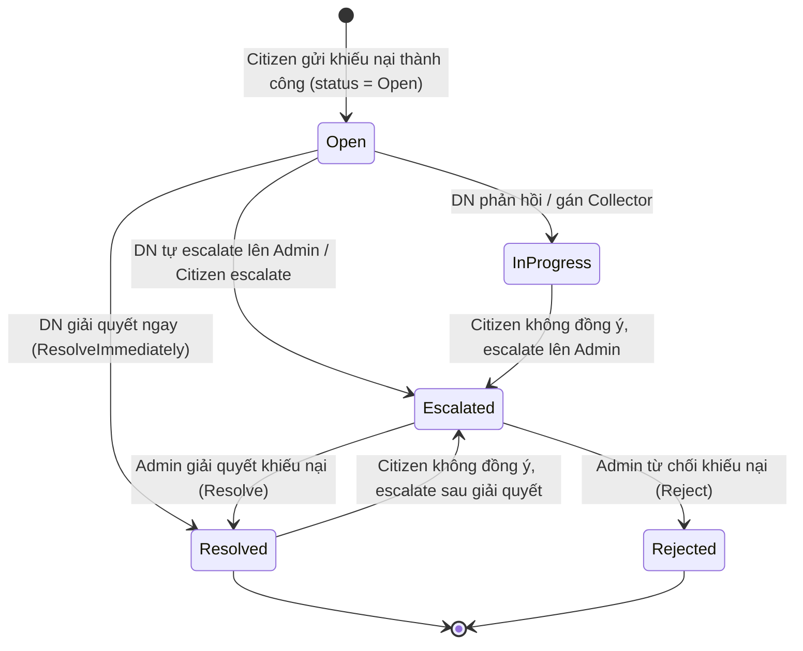

# Báo cáo Kiểm thử Module Khiếu nại (Complaints Module - KIEM-7)

Báo cáo này trình bày chi tiết kết quả áp dụng các kỹ thuật kiểm thử hộp đen: **Phân hoạch lớp tương đương (EP)**, **Phân tích giá trị biên (BVA)** và **Kiểm thử chuyển trạng thái (State Transition)** cho Module Khiếu nại (Complaints Module).

---

## 1. Phân hoạch lớp tương đương (Equivalence Partitioning)

Dựa trên tài liệu đặc tả hệ thống, chúng tôi chia miền dữ liệu đầu vào của chức năng khiếu nại thành các lớp tương đương hợp lệ và không hợp lệ:

| Biến đầu vào | Lớp hợp lệ | Tag | Lớp không hợp lệ | Tag |
|---|---|---|---|---|
| **Độ dài nội dung khiếu nại (Content length)** | $1 \le Length \le 2000$ ký tự | V1 | $Length = 0$ (Để trống/Khoảng trắng) $Length > 2000$ ký tự | X1 X2 |
| **Báo cáo liên kết (Report status)** | Report ở trạng thái đã được nhận bởi DN (`Accepted`/`Assigned`/`Collected`) | V2 | Report ở trạng thái `Pending` Report không tồn tại trong hệ thống | X3 X4 |
| **Phản hồi của Admin (Admin response)** | `AdminResponse` không được để trống khi đóng khiếu nại | V3 | `AdminResponse` trống hoặc khoảng trắng | X5 |
| **Quyền gửi khiếu nại (Citizen Ownership)** | Citizen chỉ được gửi khiếu nại cho báo cáo của chính mình | V4 | Citizen gửi khiếu nại cho báo cáo của người khác | X6 |

---

## 2. Phân tích giá trị biên (Boundary Value Analysis)

Áp dụng kỹ thuật phân tích giá trị biên đối với độ dài nội dung khiếu nại và phản hồi giải quyết:

### Biên tiêu chuẩn & mở rộng (Standard & Robustness BVA)
| Biến đầu vào | min- (R) | min | nominal | max | max+ (R) | Tag biên |
|---|---:|---:|---:|---:|---:|---|
| **Nội dung khiếu nại** | 0 | 1 | 500 | 2000 | 2001 | B1, B2, B3, B4 |
| **Phản hồi giải quyết** | 0 | 1 | 100 | - | - | B5, B6 |

---

## 3. Kiểm thử Chuyển trạng thái (State Transition Testing)

Sơ đồ chuyển đổi trạng thái của thực thể Khiếu nại (`Complaint`):

Các bước chuyển đổi trạng thái hợp lệ và không hợp lệ cần kiểm chứng:

| Trạng thái hiện tại | Trạng thái tiếp theo | Hành động kích hoạt | Hợp lệ / Không hợp lệ | Tag |
|---|---|---|---|---|
| `Open` | `InProgress` | Doanh nghiệp phản hồi | Hợp lệ | ST1 |
| `Open` | `Resolved` | Doanh nghiệp giải quyết lập tức | Hợp lệ | ST2 |
| `Open` | `Escalated` | Chuyển lên Admin | Hợp lệ | ST3 |
| `InProgress` | `Escalated` | Citizen escalate lên Admin | Hợp lệ | ST4 |
| `Resolved` | `Escalated` | Citizen escalate sau khi Resolved | Hợp lệ | ST5 |
| `Escalated` | `Resolved` | Admin Resolve khiếu nại | Hợp lệ | ST6 |
| `Escalated` | `Rejected` | Admin Reject khiếu nại | Hợp lệ | ST7 |
| `Resolved` | `InProgress` | Cập nhật lại phản hồi sau khi đã đóng | Không hợp lệ | ST_INV1 |
| `Rejected` | `Resolved` | Giải quyết khiếu nại đã bị từ chối | Không hợp lệ | ST_INV2 |

---

## 4. Danh sách các Test Case đã viết cho Complaints Module (KIEM-7)

Dưới đây là danh sách toàn bộ **83 test cases** được viết và double check cho Module Complaints (KIEM-7). Các test case được phân tách theo từng tệp mã nguồn kiểm thử tương ứng:

### CreateComplaintCommandHandlerTests.cs (9 test cases)

| STT | Tên Test Method | Mô tả kịch bản | Kết quả chạy thực tế | Tag bao phủ |
|---:|---|---|:---:|:---:|
| 1 | `Handle_WithValidCommand_ShouldCreateComplaintSuccessfully` | Tạo khiếu nại thành công với nội dung hợp lệ. | 🟢 PASSED | V1 |
| 2 | `Handle_WithValidCommandAndReportId_ShouldCreateComplaintWithEnterpriseIdFromReport` | Khiếu nại liên kết với báo cáo đã xử lý, tự động lấy EnterpriseId từ task. | 🟢 PASSED | V2 |
| 3 | `Handle_WithInvalidContent_ShouldThrowArgumentException` | Từ chối tạo khiếu nại khi nội dung rỗng/chỉ chứa khoảng trắng. | 🟢 PASSED | X1, B1 |
| 4 | `Handle_WithNonExistentReportId_ShouldThrowArgumentException` | Từ chối tạo khiếu nại khi báo cáo liên kết không tồn tại. | 🟢 PASSED | X4 |
| 5 | `Handle_WithPendingReportStatus_ShouldThrowInvalidOperationException` | Từ chối tạo khiếu nại khi báo cáo liên kết vẫn đang ở trạng thái `Pending`. | 🟢 PASSED | X3 |
| 6 | `Handle_WithExplicitEnterpriseId_ShouldUseProvidedEnterpriseId` | Tạo khiếu nại với doanh nghiệp chỉ định rõ ràng. | 🟢 PASSED | V1 |
| 7 | `Handle_ContentTooLong_ShouldThrowArgumentException_DT06_BVA` | Từ chối tạo khiếu nại khi nội dung vượt quá 2000 ký tự (2001 ký tự). | 🟢 PASSED | X2, B4 |
| 8 | `Handle_ContentExactly2000Chars_ShouldSucceed_DT06_BVA_MaxBoundary` | Tạo khiếu nại thành công với nội dung đạt giới hạn tối đa 2000 ký tự. | 🟢 PASSED | V1, B3 |
| 9 | `Handle_WhenComplaintAlreadyExistsForReport_ShouldThrowInvalidOperationException` | **[Bug 1]** Từ chối khiếu nại nếu báo cáo này đã có khiếu nại trước đó. | 🔴 **FAILED** | BR-05 |

### ResolveComplaintCommandHandlerTests.cs (8 test cases)

| STT | Tên Test Method | Mô tả kịch bản | Kết quả chạy thực tế | Tag bao phủ |
|---:|---|---|:---:|:---:|
| 1 | `Handle_WithValidComplaintId_ShouldResolveComplaintSuccessfully` | Admin giải quyết khiếu nại thành công. | 🟢 PASSED | ST6 |
| 2 | `Handle_WithValidComplaintId_ShouldUpdateComplaintStatusToResolved` | Cập nhật đúng trạng thái Resolved và ghi nhận thời gian xử lý. | 🟢 PASSED | ST6 |
| 3 | `Handle_WithValidData_ShouldReturnCorrectComplaintIdInResult` | Trả về ID của khiếu nại trong kết quả phản hồi. | 🟢 PASSED | ST6 |
| 4 | `Handle_WithDifferentAdminResponses_ShouldStoreEachResponseCorrectly` | Lưu trữ chính xác các nội dung phản hồi khác nhau của Admin. | 🟢 PASSED | V3 |
| 5 | `Handle_WithNonExistentComplaintId_ShouldReturnFailureResult` | Báo lỗi khi giải quyết khiếu nại không tồn tại. | 🟢 PASSED | X4 |
| 6 | `Handle_WithEmptyComplaintId_ShouldReturnNotFoundResult` | Báo lỗi khi Guid khiếu nại rỗng. | 🟢 PASSED | X4 |
| 7 | `Handle_WithMultipleNonExistentIds_ShouldReturnFailureForEach` | Đảm bảo tính cô lập và báo lỗi cho từng khiếu nại không tồn tại. | 🟢 PASSED | X4 |
| 8 | `Handle_WithNullOrEmptyAdminResponse_ShouldThrowArgumentException` | **[Bug 2]** Từ chối giải quyết khi phản hồi của admin trống. | 🔴 **FAILED** (3 cases) | V3, X5 |

### RejectComplaintCommandHandlerTests.cs (7 test cases)

| STT | Tên Test Method | Mô tả kịch bản | Kết quả chạy thực tế | Tag bao phủ |
|---:|---|---|:---:|:---:|
| 1 | `Handle_WithValidComplaintId_ShouldRejectComplaintSuccessfully` | Admin từ chối khiếu nại thành công kèm phản hồi. | 🟢 PASSED | ST7 |
| 2 | `Handle_WithValidComplaintId_ShouldUpdateComplaintStatusToRejected` | Cập nhật đúng trạng thái Rejected và ghi nhận thời gian. | 🟢 PASSED | ST7 |
| 3 | `Handle_WithValidData_ShouldReturnCorrectComplaintIdInResult` | Trả về ID khiếu nại bị từ chối trong kết quả. | 🟢 PASSED | ST7 |
| 4 | `Handle_WithNonExistentComplaintId_ShouldReturnFailureResult` | Báo lỗi khi từ chối khiếu nại không tồn tại. | 🟢 PASSED | X4 |
| 5 | `Handle_WithEmptyComplaintId_ShouldReturnNotFoundResult` | Báo lỗi khi ID khiếu nại rỗng. | 🟢 PASSED | X4 |
| 6 | `Handle_ShouldCallRepositoryMethodsInCorrectOrder` | Kiểm tra thứ tự gọi repository: Query trước, Save sau. | 🟢 PASSED | - |
| 7 | `Handle_WithNullOrEmptyAdminResponse_ShouldThrowArgumentException` | **[Bug 2]** Từ chối reject khi phản hồi của admin bị trống. | 🔴 **FAILED** (3 cases) | V3, X5 |

### CitizenEscalateComplaintCommandHandlerTests.cs (4 test cases)

| STT | Tên Test Method | Mô tả kịch bản | Kết quả chạy thực tế | Tag bao phủ |
|---:|---|---|:---:|:---:|
| 1 | `Handle_WithValidCommand_ShouldEscalateComplaintSuccessfully` | Citizen chuyển khiếu nại thành công lên Admin khi ở trạng thái InProgress/Resolved. | 🟢 PASSED | ST4, ST5 |
| 2 | `Handle_WhenComplaintDoesNotExist_ShouldReturnFailure` | Báo lỗi khi khiếu nại escalate không tồn tại. | 🟢 PASSED | X4 |
| 3 | `Handle_WhenComplaintBelongsToAnotherCitizen_ShouldReturnFailure` | Từ chối escalate khiếu nại không thuộc sở hữu của người gửi. | 🟢 PASSED | X6, V4 |
| 4 | `Handle_WhenComplaintStatusIsInvalid_ShouldReturnFailure` | Không cho phép escalate ở các trạng thái không hợp lệ (Open/Rejected/Escalated). | 🟢 PASSED | ST_INV3 |

### EnterpriseRespondToComplaintCommandHandlerTests.cs (6 test cases)

| STT | Tên Test Method | Mô tả kịch bản | Kết quả chạy thực tế | Tag bao phủ |
|---:|---|---|:---:|:---:|
| 1 | `Handle_WithNormalResponse_ShouldChangeStatusToInProgress` | DN phản hồi thành công và chuyển trạng thái sang InProgress. | 🟢 PASSED | ST1 |
| 2 | `Handle_WithResolveImmediately_ShouldChangeStatusToResolved` | DN giải quyết khiếu nại thành công lập tức (chuyển sang Resolved). | 🟢 PASSED | ST2 |
| 3 | `Handle_WithEscalateToAdmin_ShouldChangeStatusToEscalated` | DN chủ động escalate khiếu nại lên admin (chuyển sang Escalated). | 🟢 PASSED | ST3 |
| 4 | `Handle_WhenComplaintNotFound_ShouldReturnFailure` | Báo lỗi khi khiếu nại phản hồi không tồn tại. | 🟢 PASSED | X4 |
| 5 | `Handle_WhenEnterpriseNotAuthorized_ShouldReturnFailure` | Từ chối phản hồi nếu khiếu nại không thuộc doanh nghiệp này. | 🟢 PASSED | X6 |
| 6 | `Handle_WhenComplaintIsAlreadyClosed_ShouldReturnFailure` | Từ chối phản hồi khi khiếu nại đã đóng (Resolved/Rejected/Escalated). | 🟢 PASSED | ST_INV1 |

### ComplaintsQueriesTests.cs (5 test cases)

| STT | Tên Test Method | Mô tả kịch bản | Kết quả chạy thực tế | Tag bao phủ |
|---:|---|---|:---:|:---:|
| 1 | `GetComplaintById_WhenExists_ShouldReturnComplaintDto` | Lấy chi tiết khiếu nại theo ID thành công. | 🟢 PASSED | V1 |
| 2 | `GetComplaintById_WhenDoesNotExist_ShouldReturnNull` | Trả về null khi khiếu nại theo ID không tồn tại. | 🟢 PASSED | V1 |
| 3 | `GetCitizenComplaints_ShouldReturnPaginatedResults` | Lấy danh sách khiếu nại phân trang của Citizen. | 🟢 PASSED | V1 |
| 4 | `GetEnterpriseComplaints_ShouldReturnPaginatedResults` | Lấy danh sách khiếu nại phân trang của Enterprise. | 🟢 PASSED | V1 |
| 5 | `GetComplaints_Admin_ShouldReturnPaginatedResults` | Lấy danh sách khiếu nại phân trang và lọc theo trạng thái cho Admin. | 🟢 PASSED | V1 |

---

## 5. Dữ liệu kiểm thử sử dụng (Test Data)

* **CitizenId:** `Guid.NewGuid()` đại diện cho tài khoản công dân.
* **EnterpriseId:** `Guid.NewGuid()` đại diện cho tài khoản doanh nghiệp.
* **ReportId:** `Guid.NewGuid()` liên kết với WasteReport.
* **Nội dung khiếu nại:**
  * Hợp lệ: `"Collect not done yet"`
  * Biên tối đa: Chuỗi 2000 ký tự `'A'`
  * Vượt biên tối đa: Chuỗi 2001 ký tự `'A'`
  * Trống/Khoảng trắng: `""`, `"   "`, `null`

---

## 6. Kết quả chạy kiểm thử (Test Run Output)

Dưới đây là bảng tổng hợp kết quả thực thi các test case thuộc Complaints Module:

| Nhóm Kiểm Thử | Số Lượng Test Case | Đạt (Passed) | Lỗi (Failed) | Trạng Thái | Ghi Chú / Lỗi logic phát hiện (Bug) |
|---|---:|---:|---:|:---:|---|
| **Tạo khiếu nại** | 9 | 8 | 1 | 🔴 Failed | **Bug 1**: Chưa chặn khi một report bị khiếu nại nhiều lần (vi phạm BR-05). |
| **Admin Giải quyết** | 8 | 7 | 1 | 🔴 Failed | **Bug 2**: Chấp nhận phản hồi trống khi Resolve khiếu nại (Theory chứa 3 đầu vào lỗi -> 3 cases Failed). |
| **Admin Từ chối** | 7 | 6 | 1 | 🔴 Failed | **Bug 2**: Chấp nhận phản hồi trống khi Reject khiếu nại (Theory chứa 3 đầu vào lỗi -> 3 cases Failed). |
| **Citizen Chuyển Admin** | 4 | 4 | 0 | 🟢 Passed | Escalation hoạt động chính xác từ trạng thái InProgress/Resolved. |
| **Doanh nghiệp phản hồi** | 6 | 6 | 0 | 🟢 Passed | Phản hồi thường, giải quyết hoặc chuyển tiếp lên Admin hoạt động tốt. |
| **Truy vấn & Lọc** | 5 | 5 | 0 | 🟢 Passed | Lấy chi tiết, phân trang cho từng đối tượng hoạt động tốt. |
| **TỔNG CỘNG** | **83** | **76** | **7** | **🔴 FAILED** | **Tỷ lệ thành công: 91.6% (7 lỗi do thiếu validation trong Command Handlers)** |

---

## 7. Đường dẫn Allure Report

* **Suites Dashboard**: [http://localhost:5080/index.html#suites/AdminComplaintsControllerTests](http://localhost:5080/index.html#suites/AdminComplaintsControllerTests)
