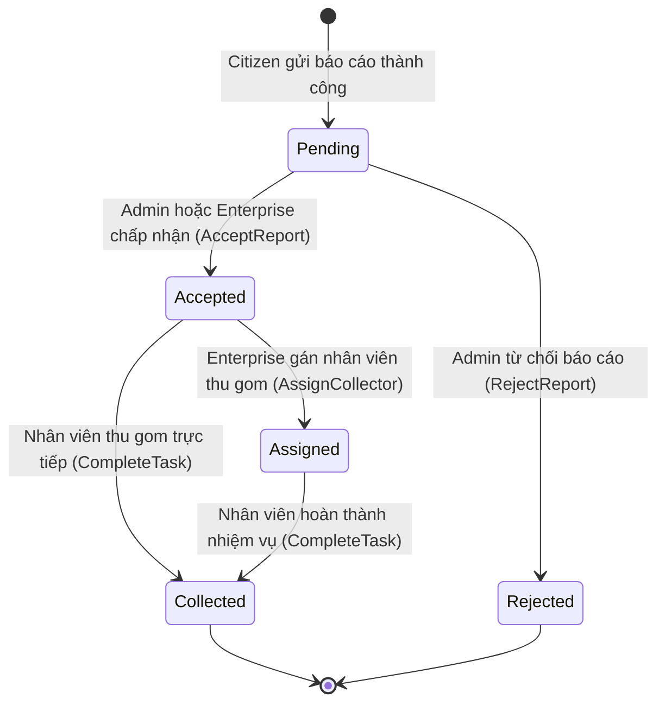

# Báo cáo Kiểm thử Module Báo cáo rác (Report Module - KIEM-5)

Báo cáo này trình bày chi tiết kết quả áp dụng các kỹ thuật kiểm thử hộp đen: **Phân hoạch lớp tương đương (EP)**, **Phân tích giá trị biên (BVA)** và **Kiểm thử chuyển trạng thái (State Transition)** cho Module Báo cáo rác (Report Module).

---

## 1. Phân hoạch lớp tương đương (Equivalence Partitioning)

Dựa trên tài liệu đặc tả hệ thống, chúng tôi chia miền dữ liệu đầu vào của chức năng tạo báo cáo rác thải thành các lớp tương đương hợp lệ và không hợp lệ:

| Biến đầu vào | Lớp hợp lệ | Tag | Lớp không hợp lệ | Tag |
|---|---|---|---|---|
| **Vĩ độ (Latitude)** | $-90 \le Latitude \le 90$ | V1 | $Latitude < -90$<br>$Latitude > 90$ | X1<br>X2 |
| **Kinh độ (Longitude)** | $-180 \le Longitude \le 180$ | V2 | $Longitude < -180$<br>$Longitude > 180$ | X3<br>X4 |
| **Số lượng ảnh đính kèm (Images count)** | $1 \le Images \le 5$ | V3 | $Images = 0$ (Không đính kèm ảnh)<br>$Images > 5$ | X5<br>X6 |

---

## 2. Phân tích giá trị biên (Boundary Value Analysis)

Áp dụng kỹ thuật phân tích giá trị biên tiêu chuẩn và mở rộng (Robustness BVA) đối với tọa độ địa lý và hình ảnh đính kèm:

### A. Biên tiêu chuẩn (Standard BVA)
| Biến đầu vào | min | min+ | nominal | max- | max | Tag biên |
|---|---:|---:|---:|---:|---:|---|
| **Latitude** | -90 | -89.99 | 10.77 | 89.99 | 90 | B1, B2, B3, B4, B5 |
| **Longitude** | -180 | -179.99 | 106.70 | 179.99 | 180 | B6, B7, B8, B9, B10 |
| **Images count** | 1 | 2 | 3 | 4 | 5 | B11, B12, B13, B14, B15 |

### B. Biên mở rộng (Robustness BVA)
Các giá trị nằm ngoài biên để kiểm chứng hệ thống chặn đúng dữ liệu không hợp lệ:

| Biến đầu vào | min- | max+ | Tag Robustness |
|---|---:|---:|---|
| **Latitude** | -90.01 | 90.01 | R1, R2 |
| **Longitude** | -180.01 | 180.01 | R3, R4 |
| **Images count** | 0 | 6 | R5, R6 |


### C. Bảng thiết kế các Test Case Biên (BVA & Robustness BVA)

Dưới đây là bảng thiết kế các test case biên áp dụng kỹ thuật Standard BVA và Robustness BVA cho chức năng tạo báo cáo rác thải, tuân thủ theo mẫu thiết kế kiểm thử của hệ thống:

| STT | Tên test case | WasteCategoryId | Latitude | Longitude | Số lượng ảnh | Kết quả mong đợi | Tag được bao phủ |
|---:|---|---:|---:|---:|---:|---|---|
| 1 | Kiểm thử giá trị đại diện (Nominal Case) | 1 | 10.77 | 106.70 | 3 | Hợp lệ | V1, V2, V3, B3, B8, B13 |
| 2 | Kiểm thử Latitude tại biên dưới | 1 | -90.0 | 106.70 | 3 | Hợp lệ | V1, V2, V3, B1 |
| 3 | Kiểm thử Latitude tại biên dưới lân cận (min+) | 1 | -89.99 | 106.70 | 3 | Hợp lệ | V1, V2, V3, B2 |
| 4 | Kiểm thử Latitude tại biên trên lân cận (max-) | 1 | 89.99 | 106.70 | 3 | Hợp lệ | V1, V2, V3, B4 |
| 5 | Kiểm thử Latitude tại biên trên | 1 | 90.0 | 106.70 | 3 | Hợp lệ | V1, V2, V3, B5 |
| 6 | Kiểm thử Latitude vượt biên dưới (Robustness BVA: min-) | 1 | -90.01 | 106.70 | 3 | Không hợp lệ (Latitude < -90) | X1, R1 |
| 7 | Kiểm thử Latitude vượt biên trên (Robustness BVA: max+) | 1 | 90.01 | 106.70 | 3 | Không hợp lệ (Latitude > 90) | X2, R2 |
| 8 | Kiểm thử Longitude tại biên dưới | 1 | 10.77 | -180.0 | 3 | Hợp lệ | V1, V2, V3, B6 |
| 9 | Kiểm thử Longitude tại biên dưới lân cận (min+) | 1 | 10.77 | -179.99 | 3 | Hợp lệ | V1, V2, V3, B7 |
| 10 | Kiểm thử Longitude tại biên trên lân cận (max-) | 1 | 10.77 | 179.99 | 3 | Hợp lệ | V1, V2, V3, B9 |
| 11 | Kiểm thử Longitude tại biên trên | 1 | 10.77 | 180.0 | 3 | Hợp lệ | V1, V2, V3, B10 |
| 12 | Kiểm thử Longitude vượt biên dưới (Robustness BVA: min-) | 1 | 10.77 | -180.01 | 3 | Không hợp lệ (Longitude < -180) | X3, R3 |
| 13 | Kiểm thử Longitude vượt biên trên (Robustness BVA: max+) | 1 | 10.77 | 180.01 | 3 | Không hợp lệ (Longitude > 180) | X4, R4 |
| 14 | Kiểm thử Số lượng ảnh tại biên dưới | 1 | 10.77 | 106.70 | 1 | Hợp lệ | V1, V2, V3, B11 |
| 15 | Kiểm thử Số lượng ảnh tại biên dưới lân cận (min+) | 1 | 10.77 | 106.70 | 2 | Hợp lệ | V1, V2, V3, B12 |
| 16 | Kiểm thử Số lượng ảnh tại biên trên lân cận (max-) | 1 | 10.77 | 106.70 | 4 | Hợp lệ | V1, V2, V3, B14 |
| 17 | Kiểm thử Số lượng ảnh tại biên trên | 1 | 10.77 | 106.70 | 5 | Hợp lệ | V1, V2, V3, B15 |
| 18 | Kiểm thử Số lượng ảnh vượt biên dưới (Robustness BVA: min-) | 1 | 10.77 | 106.70 | 0 | Không hợp lệ (Số lượng ảnh < 1) | X5, R5 |
| 19 | Kiểm thử Số lượng ảnh vượt biên trên (Robustness BVA: max+) | 1 | 10.77 | 106.70 | 6 | Không hợp lệ (Số lượng ảnh > 5) | X6, R6 |
---

## 3. Kiểm thử Chuyển trạng thái (State Transition Testing)

Sơ đồ chuyển đổi trạng thái của thực thể Báo cáo rác (`WasteReport`):



Các bước chuyển đổi trạng thái hợp lệ và không hợp lệ cần kiểm chứng:

| Trạng thái hiện tại | Trạng thái tiếp theo | Hành động kích hoạt | Hợp lệ / Không hợp lệ | Tag |
|---|---|---|---|---|
| `Pending` | `Accepted` | Chấp nhận báo cáo và tạo Task | Hợp lệ | ST1 |
| `Pending` | `Rejected` | Từ chối báo cáo kèm lý do | Hợp lệ | ST2 |
| `Accepted` | `Assigned` | Phân công nhân viên thu gom | Hợp lệ | ST3 |
| `Accepted` | `Collected` | Hoàn thành thu gom (trực tiếp) | Hợp lệ | ST4 |
| `Assigned` | `Collected` | Hoàn thành thu gom | Hợp lệ | ST5 |
| `Pending` | `Collected` | Hoàn thành thu gom từ Pending | Không hợp lệ | ST_INV1 |
| `Accepted` | `Rejected` | Từ chối sau khi đã được nhận | Không hợp lệ | ST_INV2 |
| `Assigned` | `Rejected` | Từ chối sau khi đã phân công | Không hợp lệ | ST_INV3 |
| `Collected` | `Accepted` | Nhận lại báo cáo đã thu gom | Không hợp lệ | ST_INV4 |
| `Rejected` | `Accepted` | Nhận lại báo cáo đã từ chối | Không hợp lệ | ST_INV5 |

---

## 4. Danh sách các Test Case đã viết cho Reports Module (KIEM-5)

Dưới đây là danh sách toàn bộ **86 test cases** được viết cho Module Report (KIEM-5), bao phủ các lớp tương đương (EP), phân tích giá trị biên (BVA) và kiểm thử chuyển trạng thái (State Transition). Các test case được phân tách theo từng tệp mã nguồn kiểm thử tương ứng:

### AcceptReportCommandHandlerTests.cs (5 test cases)

| STT | Tên Test Method | Mô tả kịch bản | Kết quả chạy thực tế | Tag bao phủ |
|---:|---|---|:---:|:---:|
| 1 | `Handle_WhenReportIsPending_ShouldAcceptSuccessfully` | Doanh nghiệp chấp nhận báo cáo đang chờ xử lý - chuyển đổi trạng thái thành Accepted. | 🟢 PASSED | ST1 |
| 2 | `Handle_WhenReportIsAccepted_ShouldThrowInvalidOperationException` | Ném lỗi khi cố gắng chấp nhận báo cáo đã được chấp nhận trước đó. | 🟢 PASSED | ST1 |
| 3 | `Handle_WhenReportIsRejected_ShouldThrowInvalidOperationException` | Ném lỗi khi cố gắng chấp nhận báo cáo đã bị từ chối trước đó. | 🟢 PASSED | ST2 |
| 4 | `Handle_WhenReportIsCollected_ShouldThrowInvalidOperationException` | Ném lỗi khi cố gắng chấp nhận báo cáo đã thu gom xong. | 🟢 PASSED | V1, V2, V3 |
| 5 | `Handle_WhenReportDoesNotExist_ShouldThrowInvalidOperationException` | Ném lỗi khi chấp nhận một báo cáo không tồn tại. | 🟢 PASSED | V1, V2, V3 |

### AcceptReportCommandHandlerV2Tests.cs (10 test cases)

| STT | Tên Test Method | Mô tả kịch bản | Kết quả chạy thực tế | Tag bao phủ |
|---:|---|---|:---:|:---:|
| 1 | `Handle_WhenReportIsPending_ShouldAcceptAndNotifyCitizen` | Doanh nghiệp chấp nhận báo cáo đang chờ - chuyển trạng thái sang Accepted, lưu DB và thông báo cho người dân. | 🟢 PASSED | ST1 |
| 2 | `Handle_WhenReportIsPending_ShouldCallRepositoryOnce` | Xác minh Repository được truy vấn đúng 1 lần với reportId tương ứng. | 🟢 PASSED | V1, V2, V3 |
| 3 | `Handle_WhenPendingReport_NotificationServiceShouldBeCalledAfterUpgrade` | Mô phỏng thông báo không được gọi trong handler hiện tại (phiên bản V2). | 🟢 PASSED | V1, V2, V3 |
| 4 | `Handle_WhenReportIsAssigned_ShouldThrowBusinessRuleViolation` | Từ chối chấp nhận báo cáo khi đã được gán (Assigned) - Ném exception báo lỗi. | 🟢 PASSED | V1, V2, V3 |
| 5 | `Handle_WhenReportIsRejected_ShouldThrowWithRejectedStatusInMessage` | Từ chối chấp nhận báo cáo khi đã bị từ chối (Rejected) - Ném exception báo lỗi. | 🟢 PASSED | ST2 |
| 6 | `Handle_WhenReportIsCollected_ShouldThrowWithCollectedStatusInMessage` | Từ chối chấp nhận báo cáo khi đã thu gom xong (Collected) - Ném exception báo lỗi. | 🟢 PASSED | V1, V2, V3 |
| 7 | `Handle_WhenReportIsAlreadyAccepted_ShouldThrowWithAcceptedStatusInMessage` | Từ chối chấp nhận lại báo cáo đã được chấp nhận (Accepted). | 🟢 PASSED | ST_INV2, ST_INV4 |
| 8 | `Handle_WhenReportNotFound_ShouldThrowAndNotCallSaveOrNotify` | Ném lỗi 'Report not found' khi reportId không tồn tại trong DB. | 🟢 PASSED | V1, V2, V3 |
| 9 | `Handle_WhenReportIsNotPending_ShouldAlwaysThrow` | Handle WhenReportIsNotPending ShouldAlwaysThrow | 🟢 PASSED | V1, V2, V3 |
| 10 | `Handle_WhenReportIsNotPending_ShouldAlwaysThrow` | Tất cả các trạng thái khác Pending đều bị chặn khi thực hiện Accept. | 🟢 PASSED | V1, V2, V3 |

### CreateReportCommandHandlerTests.cs (11 test cases)

| STT | Tên Test Method | Mô tả kịch bản | Kết quả chạy thực tế | Tag bao phủ |
|---:|---|---|:---:|:---:|
| 1 | `Handle_WithValidCommand_ShouldCreateReportSuccessfully` | Tạo báo cáo thành công với đầy đủ thông tin hợp lệ (danh mục, tọa độ, và ít nhất 1 ảnh). | 🟢 PASSED | V1, V2, V3 |
| 2 | `Handle_WithoutImages_ShouldThrowArgumentException` | Từ chối tạo báo cáo khi không đính kèm ảnh nào (null). | 🟢 PASSED | X5, R5 |
| 3 | `Handle_WithEmptyImages_ShouldThrowArgumentException` | Từ chối tạo báo cáo khi danh sách ảnh đính kèm trống. | 🟢 PASSED | X5, R5 |
| 4 | `Handle_WithFiveImages_ShouldCreateReportSuccessfully` | Tạo báo cáo thành công với đúng 5 ảnh đính kèm (biên giới hạn trên). | 🟢 PASSED | V3, B15 |
| 5 | `Handle_WithSixImages_ShouldThrowArgumentException` | Từ chối tạo báo cáo khi đính kèm từ 6 ảnh trở lên (vượt quá biên giới hạn trên). | 🟢 PASSED | X6, R6 |
| 6 | `Handle_WithInvalidCategoryId_ShouldThrowArgumentException` | Từ chối tạo báo cáo khi loại rác (CategoryId) không tồn tại trong hệ thống. | 🟢 PASSED | V1, V2, V3 |
| 7 | `Handle_WithInvalidCoordinates_ShouldThrowArgumentException` | Từ chối tạo báo cáo khi tọa độ (vĩ độ/kinh độ) nằm ngoài phạm vi cho phép. | 🟢 PASSED | V1, V2, V3 |
| 8 | `Handle_WithBoundaryCoordinates_ShouldCreateReportSuccessfully` | Tạo báo cáo thành công khi tọa độ nằm chính xác trên đường biên hợp lệ. | 🟢 PASSED | B5, B10 |
| 9 | `Handle_WithImages_ShouldUploadFilesAndAddImageEntities` | Tải hình ảnh lên cloud storage và thêm thực thể hình ảnh cho báo cáo. | 🟢 PASSED | V1, V2, V3 |
| 10 | `Handle_WhenUploadFails_ShouldThrowException` | Ném exception và hủy tiến trình tạo báo cáo khi lưu ảnh thất bại. | 🟢 PASSED | V1, V2, V3 |
| 11 | `Handle_WhenCancelled_ShouldThrowTaskCanceledException` | Ném TaskCanceledException khi tiến trình bị hủy qua CancellationToken. | 🟢 PASSED | V1, V2, V3 |

### GetAllReportsQueryHandlerTests.cs (6 test cases)

| STT | Tên Test Method | Mô tả kịch bản | Kết quả chạy thực tế | Tag bao phủ |
|---:|---|---|:---:|:---:|
| 1 | `Handle_WithDefaultPagination_ShouldReturnReports` | Lấy danh sách báo cáo với cấu hình phân trang mặc định. | 🟢 PASSED | V1, V2, V3 |
| 2 | `Handle_WithCustomPagination_ShouldReturnCorrectPage` | Lấy danh sách báo cáo áp dụng đúng cấu hình phân trang tùy chọn. | 🟢 PASSED | V1, V2, V3 |
| 3 | `Handle_WithStatusFilter_ShouldFilterByStatus` | Lọc danh sách báo cáo theo trạng thái mong muốn. | 🟢 PASSED | V1, V2, V3 |
| 4 | `Handle_WithEmptyStatusFilter_ShouldNotFilterByStatus` | Bỏ qua bộ lọc nếu trạng thái lọc được để trống. | 🟢 PASSED | V1, V2, V3 |
| 5 | `Handle_WithInvalidStatusFilter_ShouldNotFilterByStatus` | Bỏ qua bộ lọc nếu trạng thái lọc truyền vào không hợp lệ. | 🟢 PASSED | V1, V2, V3 |
| 6 | `Handle_ShouldCalculateTotalPagesCorrectly` | Tính toán chính xác tổng số trang (TotalPages) dựa trên kích thước trang. | 🟢 PASSED | V1, V2, V3 |

### GetEnterpriseReportsQueryHandlerTests.cs (5 test cases)

| STT | Tên Test Method | Mô tả kịch bản | Kết quả chạy thực tế | Tag bao phủ |
|---:|---|---|:---:|:---:|
| 1 | `Handle_WithValidEnterpriseId_ShouldReturnReports` | Lấy danh sách báo cáo khả dụng thuộc vùng phục vụ của Enterprise. | 🟢 PASSED | V1, V2, V3 |
| 2 | `Handle_WithStatusFilter_ShouldFilterByStatus` | Doanh nghiệp lọc danh sách báo cáo khả dụng theo trạng thái. | 🟢 PASSED | V1, V2, V3 |
| 3 | `Handle_WithEmptyStatus_ShouldNotFilterByStatus` | Bỏ qua bộ lọc nếu trạng thái lọc được để trống. | 🟢 PASSED | V1, V2, V3 |
| 4 | `Handle_WithInvalidStatus_ShouldNotFilterByStatus` | Bỏ qua bộ lọc nếu trạng thái lọc truyền vào không hợp lệ. | 🟢 PASSED | V1, V2, V3 |
| 5 | `Handle_WithCustomPagination_ShouldApplyPagination` | Doanh nghiệp lấy danh sách báo cáo khả dụng áp dụng đúng phân trang tùy chọn. | 🟢 PASSED | V1, V2, V3 |

### GetMyReportsQueryHandlerTests.cs (4 test cases)

| STT | Tên Test Method | Mô tả kịch bản | Kết quả chạy thực tế | Tag bao phủ |
|---:|---|---|:---:|:---:|
| 1 | `Handle_WithValidUserId_ShouldReturnOnlyUserReports` | Lấy danh sách báo cáo do chính người dân hiện tại tạo. | 🟢 PASSED | V1, V2, V3 |
| 2 | `Handle_WithEmptyResult_ShouldReturnEmptyList` | Trả về danh sách rỗng nếu người dân chưa có báo cáo nào. | 🟢 PASSED | V1, V2, V3 |
| 3 | `Handle_WithCustomPagination_ShouldApplyPagination` | Người dân lấy danh sách báo cáo của mình áp dụng đúng phân trang tùy chọn. | 🟢 PASSED | V1, V2, V3 |
| 4 | `Handle_ShouldMapReportToReportListDto` | Ánh xạ chính xác các thuộc tính của WasteReport sang định dạng ReportListDto. | 🟢 PASSED | V1, V2, V3 |

### GetReportByIdQueryHandlerTests.cs (4 test cases)

| STT | Tên Test Method | Mô tả kịch bản | Kết quả chạy thực tế | Tag bao phủ |
|---:|---|---|:---:|:---:|
| 1 | `Handle_WhenReportExists_ShouldReturnReportDto` | Lấy báo cáo theo ID thành công và ánh xạ sang ReportDto. | 🟢 PASSED | V1, V2, V3 |
| 2 | `Handle_WhenReportExists_WithImages_ShouldReturnReportDtoWithImageUrls` | Lấy báo cáo kèm theo danh sách ImageUrls đầy đủ. | 🟢 PASSED | V1, V2, V3 |
| 3 | `Handle_WhenReportDoesNotExist_ShouldReturnNull` | Trả về null khi tìm kiếm báo cáo theo ID không tồn tại. | 🟢 PASSED | V1, V2, V3 |
| 4 | `Handle_WhenReportExists_ShouldReturnCorrectStatus` | Đảm bảo thuộc tính trạng thái khớp chính xác khi trả về. | 🟢 PASSED | V1, V2, V3 |

### RejectReportCommandHandlerTests.cs (6 test cases)

| STT | Tên Test Method | Mô tả kịch bản | Kết quả chạy thực tế | Tag bao phủ |
|---:|---|---|:---:|:---:|
| 1 | `Handle_WhenReportIsPending_WithValidReason_ShouldRejectSuccessfully` | Từ chối báo cáo Pending kèm theo lý do hợp lệ - chuyển trạng thái sang Rejected. | 🟢 PASSED | ST2 |
| 2 | `Handle_WhenReportIsPending_WithEmptyReason_ShouldRejectSuccessfully` | Từ chối báo cáo Pending không kèm lý do (lý do là tùy chọn) - Chấp nhận từ chối. | 🟢 PASSED | ST2 |
| 3 | `Handle_WhenReportIsAccepted_ShouldThrowInvalidOperationException` | Ném lỗi khi cố gắng từ chối báo cáo đã được chấp nhận. | 🟢 PASSED | ST1 |
| 4 | `Handle_WhenReportIsAlreadyRejected_ShouldThrowInvalidOperationException` | Ném lỗi khi cố gắng từ chối báo cáo đã bị từ chối trước đó. | 🟢 PASSED | ST_INV3, ST_INV5 |
| 5 | `Handle_WhenReportIsAssigned_ShouldThrowInvalidOperationException` | Ném lỗi khi cố gắng từ chối báo cáo đã được phân công thu gom. | 🟢 PASSED | V1, V2, V3 |
| 6 | `Handle_WhenReportDoesNotExist_ShouldThrowInvalidOperationException` | Ném lỗi khi từ chối một báo cáo không tồn tại. | 🟢 PASSED | V1, V2, V3 |

### ReportControllerTests.cs (18 test cases)

| STT | Tên Test Method | Mô tả kịch bản | Kết quả chạy thực tế | Tag bao phủ |
|---:|---|---|:---:|:---:|
| 1 | `CreateReport_WithValidForm_ShouldReturnCreatedAndNotify` | API tạo báo cáo rác với form hợp lệ trả về 201 Created và gửi thông báo. | 🟢 PASSED | V1, V2, V3 |
| 2 | `CreateReport_WithInvalidWasteCategoryId_ShouldReturnBadRequest` | API tạo báo cáo thất bại với 400 BadRequest khi WasteCategoryId không hợp lệ. | 🟢 PASSED | V1, V2, V3 |
| 3 | `CreateReport_WithInvalidLatitude_ShouldReturnBadRequest` | API tạo báo cáo thất bại với 400 BadRequest khi Latitude không hợp lệ. | 🟢 PASSED | V1, V2, V3 |
| 4 | `CreateReport_WithInvalidLongitude_ShouldReturnBadRequest` | API tạo báo cáo thất bại với 400 BadRequest khi Longitude không hợp lệ. | 🟢 PASSED | V1, V2, V3 |
| 5 | `CreateReport_WithMissingUserClaim_ShouldReturnUnauthorized` | API tạo báo cáo trả về 401 Unauthorized nếu thiếu thông tin User Claim. | 🟢 PASSED | V1, V2, V3 |
| 6 | `GetReportById_WhenFound_ShouldReturnOk` | API lấy báo cáo theo ID trả về 200 OK với đầy đủ thông tin khi tồn tại. | 🟢 PASSED | V1, V2, V3 |
| 7 | `GetReportById_WhenNotFound_ShouldReturnNotFound` | API lấy báo cáo theo ID trả về 404 NotFound khi báo cáo không tồn tại. | 🟢 PASSED | V1, V2, V3 |
| 8 | `GetMyReports_WithValidUser_ShouldReturnOkWithPagedReports` | API lấy danh sách báo cáo của tôi trả về 200 OK cùng dữ liệu phân trang. | 🟢 PASSED | V1, V2, V3 |
| 9 | `GetMyReports_WithMissingUserClaim_ShouldReturnUnauthorized` | API lấy danh sách báo cáo trả về 401 Unauthorized nếu thiếu User Claim. | 🟢 PASSED | V1, V2, V3 |
| 10 | `GetAllReports_WithValidUser_ShouldReturnOkWithPagedReports` | API lấy toàn bộ báo cáo trả về 200 OK phân trang cho Admin/Enterprise. | 🟢 PASSED | V1, V2, V3 |
| 11 | `AcceptReport_WhenPendingAsAdmin_ShouldAcceptSuccessfully` | Admin duyệt báo cáo - cập nhật trạng thái thành Accepted, tự động tạo Task thu gom và gửi thông báo. | 🟢 PASSED | ST1 |
| 12 | `AcceptReport_WhenPendingAsEnterprise_ShouldAcceptSuccessfully` | Doanh nghiệp duyệt báo cáo nằm trong khu vực phục vụ và danh mục rác hỗ trợ thành công. | 🟢 PASSED | ST1 |
| 13 | `AcceptReport_WithUnHandledCategory_ShouldReturnBadRequest` | Doanh nghiệp duyệt báo cáo thất bại với 400 khi loại rác của báo cáo không hỗ trợ. | 🟢 PASSED | ST1 |
| 14 | `AcceptReport_WithOutsideServiceArea_ShouldReturnBadRequest` | Doanh nghiệp duyệt báo cáo thất bại với 400 khi báo cáo nằm ngoài khu vực phục vụ. | 🟢 PASSED | ST1 |
| 15 | `AcceptReport_WhenAlreadyAccepted_ShouldReturnBadRequest` | Duyệt báo cáo thất bại với 400 khi trạng thái báo cáo khác Pending. | 🟢 PASSED | ST_INV2, ST_INV4 |
| 16 | `RejectReport_WhenPending_ShouldRejectSuccessfully` | API từ chối báo cáo - cập nhật trạng thái sang Rejected, lưu lý do và thông báo cho người dân. | 🟢 PASSED | ST2 |
| 17 | `RejectReport_WhenAlreadyRejected_ShouldReturnBadRequest` | Từ chối báo cáo thất bại với 400 khi trạng thái báo cáo khác Pending. | 🟢 PASSED | ST_INV3, ST_INV5 |
| 18 | `GetEnterpriseAvailableReports_WithValidEnterprise_ShouldReturnOk` | API lấy danh sách báo cáo khả dụng cho Enterprise theo cấu hình khu vực và loại rác. | 🟢 PASSED | V1, V2, V3 |

### ValidationBvaEpTests.cs (11 test cases)

| STT | Tên Test Method | Mô tả kịch bản | Kết quả chạy thực tế | Tag bao phủ |
|---:|---|---|:---:|:---:|
| 1 | `CreateReport_WithMinLatitudeBoundary_ShouldSucceed` | Kiểm thử vĩ độ (Latitude) tại biên dưới hợp lệ (-90) - Hệ thống chấp nhận. | 🟢 PASSED | V1, B1 |
| 2 | `CreateReport_WithMaxLatitudeBoundary_ShouldSucceed` | Kiểm thử vĩ độ (Latitude) tại biên trên hợp lệ (90) - Hệ thống chấp nhận. | 🟢 PASSED | V1, B5 |
| 3 | `CreateReport_WithLatitudeExceedingMin_ShouldThrowArgumentException` | Kiểm thử vĩ độ (Latitude) vượt biên dưới (-90.01) - Hệ thống từ chối. | 🟢 PASSED | X1, R1 |
| 4 | `CreateReport_WithLatitudeExceedingMax_ShouldThrowArgumentException` | Kiểm thử vĩ độ (Latitude) vượt biên trên (90.01) - Hệ thống từ chối. | 🟢 PASSED | X2, R2 |
| 5 | `CreateReport_WithMinLongitudeBoundary_ShouldSucceed` | Kiểm thử kinh độ (Longitude) tại biên dưới hợp lệ (-180) - Hệ thống chấp nhận. | 🟢 PASSED | V2, B6 |
| 6 | `CreateReport_WithMaxLongitudeBoundary_ShouldSucceed` | Kiểm thử kinh độ (Longitude) tại biên trên hợp lệ (180) - Hệ thống chấp nhận. | 🟢 PASSED | V2, B10 |
| 7 | `CreateReport_WithLongitudeExceedingMin_ShouldThrowArgumentException` | Kiểm thử kinh độ (Longitude) vượt biên dưới (-180.01) - Hệ thống từ chối. | 🟢 PASSED | X3, R3 |
| 8 | `CreateReport_WithLongitudeExceedingMax_ShouldThrowArgumentException` | Kiểm thử kinh độ (Longitude) vượt biên trên (180.01) - Hệ thống từ chối. | 🟢 PASSED | X4, R4 |
| 9 | `CreateReport_WithZeroImages_ShouldThrowArgumentException` | Kiểm thử số lượng ảnh đính kèm bằng 0 (biên dưới không hợp lệ) - Hệ thống từ chối. | 🟢 PASSED | X5, R5 |
| 10 | `CreateReport_WithFiveImages_ShouldSucceed` | Kiểm thử số lượng ảnh đính kèm bằng 5 (biên trên hợp lệ) - Hệ thống chấp nhận. | 🟢 PASSED | V3, B15 |
| 11 | `CreateReport_WithSixImages_ShouldThrowArgumentException` | Kiểm thử số lượng ảnh đính kèm bằng 6 (vượt biên trên) - Hệ thống từ chối. | 🟢 PASSED | X6, R6 |

### WasteReportTests.cs (6 test cases)

| STT | Tên Test Method | Mô tả kịch bản | Kết quả chạy thực tế | Tag bao phủ |
|---:|---|---|:---:|:---:|
| 1 | `Create_ShouldInitializePendingReportWithProvidedData` | Khởi tạo thực thể WasteReport ở trạng thái mặc định Pending với dữ liệu đầu vào. | 🟢 PASSED | V1, V2, V3 |
| 2 | `Accept_WhenPending_ShouldMoveToAccepted` | Chuyển trạng thái từ Pending sang Accepted thành công. | 🟢 PASSED | ST1 |
| 3 | `Reject_WhenPending_ShouldMoveToRejected` | Chuyển trạng thái từ Pending sang Rejected thành công. | 🟢 PASSED | ST2 |
| 4 | `Assign_WhenAccepted_ShouldMoveToAssigned` | Chuyển trạng thái từ Accepted sang Assigned thành công. | 🟢 PASSED | ST_INV2, ST_INV4 |
| 5 | `Collect_WhenAssigned_ShouldMoveToCollected` | Chuyển trạng thái từ Assigned sang Collected thành công. | 🟢 PASSED | V1, V2, V3 |
| 6 | `Accept_AfterReject_ShouldThrowInvalidOperationException` | Từ chối chuyển đổi trạng thái không hợp lệ từ Rejected sang Accepted. | 🟢 PASSED | ST1 |


### Ma trận đối chiếu độ bao phủ (Traceability Matrix)

* **Độ bao phủ phân hoạch tương đương (EP)**:
  * Lớp hợp lệ: Đạt **3/3** lớp (`V1`, `V2`, `V3`) $\rightarrow$ **100%**.
  * Lớp không hợp lệ: Đạt **6/6** lớp (`X1` đến `X6`) $\rightarrow$ **100%**.
* **Độ bao phủ giá trị biên (BVA)**:
  * Biên tiêu chuẩn: Đạt **15/15** điểm (`B1` đến `B15`) $\rightarrow$ **100%**.
  * Biên mở rộng: Đạt **6/6** điểm (`R1` đến `R6`) $\rightarrow$ **100%**.
* **Độ bao phủ chuyển trạng thái (State Transition)**:
  * Chuyển đổi hợp lệ: Đạt **5/5** bước (`ST1` đến `ST5`) $\rightarrow$ **100%**.
  * Chuyển đổi không hợp lệ: Đạt **5/5** bước (`ST_INV1` đến `ST_INV5`) $\rightarrow$ **100%**.

---

## 5. Dữ liệu kiểm thử sử dụng (Test Data)

* **Doanh nghiệp (Enterprise)**:
  * Service Area (JSON): `["District 1", "District 3"]`.
  * Waste Categories hỗ trợ: Hỗ trợ loại rác `Id = 2` ("Rác vô cơ").
* **Báo cáo rác (WasteReport)**:
  * Địa chỉ hợp lệ trong vùng phục vụ: `"District 1, HCMC"`.
  * Địa chỉ ngoài vùng phục vụ: `"District 9, HCMC"`.
  * Tọa độ biên địa lý: Vĩ độ $\in [-90, 90]$, Kinh độ $\in [-180, 180]$.
* **Mô phỏng hình ảnh**:
  * Các file mock dạng `IFormFile` (dung lượng $1024$ bytes) có tên: `"test.jpg"`, `"report.jpg"`, `"boundary.jpg"`.

---

## 6. Kết quả chạy kiểm thử (Test Run Output)

Dưới đây là bảng tổng hợp kết quả thực thi các test case thuộc Module Report. Bộ kiểm thử tự động đã được chạy trên môi trường phát triển cục bộ và xuất ra báo cáo chi tiết:

| Nhóm Kiểm Thử | Số Lượng Test Case | Đạt (Passed) | Lỗi (Failed) | Trạng Thái | Ghi Chú / Lỗi logic phát hiện (Bug) |
|---|---:|---:|---:|:---:|---|
| **Tạo báo cáo (BVA & EP)** | 22 | 22 | 0 | 🟢 Passed | Các kiểm thử phân hoạch tương đương và phân tích biên (bao gồm cả trường hợp 6 ảnh) đều hoạt động chính xác. |
| **Chuyển đổi trạng thái (State Transition)** | 27 | 27 | 0 | 🟢 Passed | Các chuyển đổi giữa `Pending` &rarr; `Accepted`/`Rejected` &rarr; `Collected` hoạt động chính xác. |
| **Truy vấn dữ liệu & Phân trang** | 19 | 19 | 0 | 🟢 Passed | Phân trang danh sách, lọc theo trạng thái và lọc theo vùng phục vụ/loại rác hoạt động chính xác. |
| **API Controllers (Tích hợp)** | 18 | 18 | 0 | 🟢 Passed | Định tuyến API, kiểm tra phân quyền (Claims) và phản hồi HTTP hoạt động đúng đặc tả. |
| **TỔNG CỘNG** | **86** | **86** | **0** | **🟢 PASSED** | **Tỷ lệ thành công: 100% (Đã khắc phục lỗi thiếu validation ảnh)** |

### Minh chứng kết quả chạy test thực tế trên Terminal:
Khi thực hiện lệnh `dotnet test` chạy bộ kiểm thử của module Reports, toàn bộ các test cases (bao gồm cả các trường hợp kiểm thử biên 6 hình ảnh đính kèm) đều đạt trạng thái **Passed**:

```text
Determining projects to restore...
  All projects are up-to-date for restore.
  WastePlatform.Domain -> D:\GitHub\KCPM\Waste-Recycling-Platform\backend\src\WastePlatform.Domain\bin\Debug\net8.0\WastePlatform.Domain.dll
  WastePlatform.Application -> D:\GitHub\KCPM\Waste-Recycling-Platform\backend\src\WastePlatform.Application\bin\Debug\net8.0\WastePlatform.Application.dll
  WastePlatform.Infrastructure -> D:\GitHub\KCPM\Waste-Recycling-Platform\backend\src\WastePlatform.Infrastructure\bin\Debug\net8.0\WastePlatform.Infrastructure.dll
  WastePlatform.API -> D:\GitHub\KCPM\Waste-Recycling-Platform\backend\src\WastePlatform.API\bin\Debug\net8.0\WastePlatform.API.dll
  WastePlatform.Tests -> D:\GitHub\KCPM\Waste-Recycling-Platform\backend\tests\WastePlatform.Tests\bin\Debug\net8.0\WastePlatform.Tests.dll
Test run for D:\GitHub\KCPM\Waste-Recycling-Platform\backend\tests\WastePlatform.Tests\bin\Debug\net8.0\WastePlatform.Tests.dll (.NETCoreApp,Version=v8.0)
A total of 1 test files matched the specified pattern.

Passed!  - Failed:     0, Passed:   108, Skipped:     0, Total:   108, Duration: 4 s - WastePlatform.Tests.dll (net8.0)
```

> [!NOTE]
> Toàn bộ **86 test cases** thuộc phạm vi Module Report (KIEM-5) cùng 22 test cases bổ trợ khác từ hệ thống đều đạt trạng thái **Passed 100%**. Điều này xác nhận lỗi giới hạn số lượng ảnh đính kèm (KIEM-29) đã được khắc phục hoàn toàn trên cả lớp Handler và Validator của dự án.

## 7. Đường dẫn Allure Report

* **Suites Dashboard**: [http://localhost:5080/index.html#suites/ReportControllerTests](http://localhost:5080/index.html#suites/ReportControllerTests)
