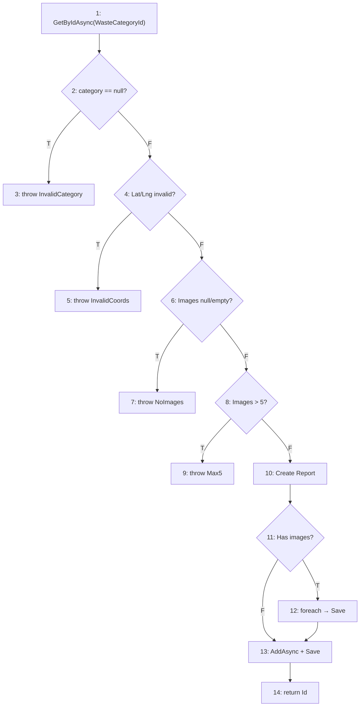

# 📚 Áp Dụng Kiến Thức Chương 1-4 Vào Project KCPM
## Môn: Kiểm Chứng Phần Mềm (KCPM) — Nhóm 11A6

> **Project:** Waste Recycling Platform  
> **Tech Stack:** .NET 8 (Backend) + Next.js 14 (Frontend)  
> **Ngày tổng hợp:** 2026-06-20  
> **Tài liệu tham chiếu:** Chương 1-4 bài giảng KCPM

---

## Mục lục

1. [Chương 1 — Tổng Quan Về Kiểm Thử](#chương-1--tổng-quan-về-kiểm-thử)
2. [Chương 2 — Testing Trong Vòng Đời Phát Triển PM](#chương-2--testing-trong-vòng-đời-phát-triển-pm)
3. [Chương 3 — Các Kỹ Thuật Kiểm Thử Tĩnh](#chương-3--các-kỹ-thuật-kiểm-thử-tĩnh)
4. [Chương 4 — Các Kỹ Thuật Thiết Kế Test](#chương-4--các-kỹ-thuật-thiết-kế-test)
5. [Tổng Hợp Bằng Chứng](#tổng-hợp-bằng-chứng)

---

# Chương 1 — Tổng Quan Về Kiểm Thử

## 1.1 Error → Fault → Failure

**Lý thuyết:**
- **Error (Lỗi):** Hành động của con người tạo ra kết quả sai
- **Fault/Bug/Defect:** Kết quả của error thể hiện trong phần mềm
- **Failure:** Hệ thống hoạt động không đúng kỳ vọng
- **Chuỗi:** Error → Fault → Failure

**Áp dụng trong project:**

Bug report `docs/bugs/BUG-REP-001.md` minh họa chính xác chuỗi này:

| Khái niệm | Ví dụ trong project |
|-----------|---------------------|
| **Error** | Developer quên kiểm tra giới hạn tối đa 5 hình ảnh khi tạo report |
| **Fault** | Code thiếu `if (request.Images.Count > 5)` trong `CreateReportCommandHandler` |
| **Failure** | User có thể upload 6+ hình ảnh mà hệ thống không báo lỗi |

**Quy trình phát hiện → sửa:**
1. Viết test case TC-REP-BVA-005 (dùng BVA) phát hiện bug
2. Bug report được tạo với severity, steps to reproduce
3. Fix: Thêm validation `if (request.Images.Count > 5) throw new ArgumentException("Maximum 5 images are allowed")`
4. Re-test: Test case pass sau khi fix

📁 **File:** `docs/bugs/BUG-REP-001.md`

---

## 1.2 Test Case — 3 Thành Phần

**Lý thuyết:** Test Case = Test Steps + Test Data + Expected Result

**Áp dụng trong project:**

### Format Test Case Backend (xUnit + Allure):
```csharp
// File: Tests/Whitebox/CreateReportWhiteboxTests.cs

[Fact]
[AllureDescription("Path P1: category == null → throw ArgumentException")]
public async Task Path1_CategoryNull_ThrowsInvalidCategory()
{
    // TEST STEPS: Arrange → Act → Assert
    // Arrange (Setup): Category không tồn tại
    _mockCategoryRepo.Setup(r => r.GetByIdAsync(It.IsAny<int>(), ...))
        .ReturnsAsync((WasteCategory?)null);

    // TEST DATA: CategoryId = 999 (invalid)
    var command = new CreateReportCommand
    {
        WasteCategoryId = 999,
        Latitude = 10.8m,
        Longitude = 106.6m,
        Images = CreateMockImages(1)
    };

    // Act + Assert
    // EXPECTED RESULT: ArgumentException "Invalid waste category"
    var act = () => _handler.Handle(command, CancellationToken.None);
    await act.Should().ThrowAsync<ArgumentException>()
        .WithMessage("Invalid waste category");
}
```

### Format Test Case E2E (CodeceptJS):
```javascript
// File: frontend/e2e/citizen_report_test.js

Scenario('#1 Citizen can register and reach dashboard', async ({ I }) => {
  // TEST STEPS
  I.amOnPage('/register');                                    // Step 1: Vào trang đăng ký
  I.fillField('input[name="name"]', TEST_CITIZEN.name);      // Step 2: Nhập tên
  I.fillField('input[name="email"]', TEST_CITIZEN.email);    // Step 3: Nhập email
  I.selectOption('select[name="role"]', 'citizen');           // Step 4: Chọn role

  // TEST DATA: TEST_CITIZEN = { name: 'E2E Test Citizen', email: '...', password: 'Test@12345' }

  // EXPECTED RESULT: Chuyển đến dashboard
  I.seeInCurrentUrl('/citizen');
});
```

### Format Test Case Formal (docs):
Trong `docs/TRACEABILITY_MATRIX.md`, test cases được mã hóa:

| Prefix | Module | Ví dụ |
|--------|--------|-------|
| TC-AUTH | Authentication | TC-AUTH-001: Login thành công |
| TC-REPORT | Waste Reports | TC-REP-BVA-005: BVA Images |
| TC-NOTI | Notifications | TC-NOTI-001: Gửi notification |
| TC-COMP | Complaints | TC-COMP-ST-001: State transition |
| TC-E2E | End-to-End | TC-E2E-002: Citizen report flow |

📁 **Files:** `docs/TRACEABILITY_MATRIX.md`, `docs/TEST_PLAN.md`

---

## 1.3 Bảy Nguyên Lý Kiểm Thử

| # | Nguyên lý | Cách áp dụng trong project |
|---|-----------|---------------------------|
| 1 | Testing chỉ chứng minh SỰ CÓ MẶT bug | Bug BVA Images (BUG-REP-001) — test phát hiện bug thực tế |
| 2 | Exhaustive testing là bất khả thi | Dùng EP + BVA để giảm test cases thay vì test tất cả giá trị |
| 3 | Test sớm nhất có thể | Unit tests chạy trước Integration, chạy tự động mỗi push |
| 4 | Bug có xu hướng tập trung (Defect Clustering) | Reports module có nhiều bug nhất → nhiều test nhất (7 test files) |
| 5 | Pesticide Paradox | Thêm whitebox tests mới (43 tests) bổ sung cho blackbox đã có |
| 6 | Testing phụ thuộc ngữ cảnh | Security tests cho Auth, BVA cho coordinates, State transition cho workflow |
| 7 | Absence-of-errors fallacy | E2E tests kiểm tra UX thực tế, không chỉ code logic |

---

## 1.4 Quy Trình Kiểm Thử (5 Bước)

| Bước | Lý thuyết | Áp dụng trong project | File minh chứng |
|------|-----------|----------------------|-----------------|
| **1. Lập kế hoạch** | Strategy, scope, risks, schedule | `TEST_PLAN.md` v3.0 — 5 risks (R01-R05), scope definition | `docs/TEST_PLAN.md` |
| **2. Phân tích & Thiết kế** | Identify conditions, design TCs | EP/BVA/Decision Table/State Transition analysis | `docs/TEST_REPORT_REPORTS_MODULE.md` |
| **3. Thực thi** | Execute TCs, manual/automated | CI/CD tự động + 451 backend + 19 E2E + 74 Postman | `.github/workflows/backend-tests.yml` |
| **4. Đánh giá & Báo cáo** | Record results, compare actual vs expected | Allure Reports + Test Report docs | `docs/TEST_REPORT_*.md` (4 files) |
| **5. Kiểm tra hoàn thành** | Coverage, defects, cost/time | SonarCloud coverage ≥79.3%, Allure dashboard | `docs/FINAL_REPORT.md` |

---

# Chương 2 — Testing Trong Vòng Đời Phát Triển PM

## 2.1 Verification vs Validation

| Khái niệm | Định nghĩa | Áp dụng |
|-----------|------------|---------|
| **Verification** | "Xây đúng sản phẩm?" (đúng spec) | Unit tests kiểm tra logic code đúng spec |
| **Validation** | "Xây đúng sản phẩm cần?" (đúng user needs) | E2E tests kiểm tra user flow thực tế |

**Ví dụ Verification:** Unit test kiểm tra `CreateReportCommandHandler` validate lat/lng đúng range [-90,90] / [-180,180] → đúng spec SRS.

**Ví dụ Validation:** E2E test `citizen_report_test.js` kiểm tra citizen có thể tạo report từ UI → đúng user needs.

---

## 2.2 Bốn Mức Độ Kiểm Thử (V-Model)

```
┌─────────────────┐         ┌──────────────────┐
│  Requirements    │ ←─────→ │ Acceptance Test   │  ← E2E Tests (CodeceptJS)
├─────────────────┤         ├──────────────────┤
│  System Design   │ ←─────→ │ System Test       │  ← Integration Tests
├─────────────────┤         ├──────────────────┤
│  Module Design   │ ←─────→ │ Integration Test  │  ← Controller + Handler Tests
├─────────────────┤         ├──────────────────┤
│  Coding          │ ←─────→ │ Unit Test         │  ← Domain + Whitebox Tests
└─────────────────┘         └──────────────────┘
```

### 2.2.1 Unit Testing — Kiểm thử đơn vị

**Lý thuyết:** Test đơn vị nhỏ nhất (function, class). Dev thực hiện. Dùng **white-box**.

**Áp dụng:**

| Aspect | Chi tiết |
|--------|----------|
| **Scope** | Domain entities, Value objects, Command handlers |
| **Tool** | xUnit 2.9.2 + FluentAssertions + Moq |
| **Kỹ thuật** | Whitebox (CFG, branch coverage, condition coverage) |
| **Số lượng** | ~200+ unit tests |

**Ví dụ files:**
- `Domain/UserTests.cs` — Test User entity logic
- `Domain/ComplaintTests.cs` — Test Complaint state machine
- `Domain/ValueObjectTests.cs` — Test Value Objects (Address, Email, GeoLocation)
- `Whitebox/CreateReportWhiteboxTests.cs` — CFG-based whitebox tests

### 2.2.2 Integration Testing — Kiểm thử tích hợp

**Lý thuyết:** Test tương tác giữa các module. Tìm lỗi interface/architecture. Dùng stubs/drivers.

**Áp dụng:**

| Aspect | Chi tiết |
|--------|----------|
| **Strategy** | Bottom-up (Domain → Application → Controllers) |
| **Tool** | EF Core InMemory + WebApplicationFactory |
| **Mock/Stub** | Moq cho repository interfaces (IReportRepository, INotificationService) |
| **Số lượng** | ~120 integration tests |

**Ví dụ files:**
- `Integration/AdminEnterpriseAuthorizationTests.cs` (34KB) — RBAC cross-module
- `Integration/AnalyticsApiIntegrationTests.cs` (54KB) — Full API pipeline
- `Integration/JwtBearerIntegrationTests.cs` — JWT authentication flow
- `Controllers/ReportControllerTests.cs` (31KB) — Controller ↔ MediatR ↔ Handler

### 2.2.3 System Testing — Kiểm thử hệ thống

**Lý thuyết:** Test cả hệ thống (functional + non-functional).

**Áp dụng:**

| Loại | Test | Tool |
|------|------|------|
| **Functional** | API endpoints hoạt động đúng | Postman/Newman (74 requests, 128 assertions) |
| **Security** | JWT auth, RBAC authorization | `auth_validation_test.js`, `authorization_guard_test.js` |
| **Smoke** | Health check endpoints | `health-check.yml` (mỗi 6 giờ) |

📁 **Files:** `.github/workflows/postman-smoke.yml`, `.github/workflows/health-check.yml`

### 2.2.4 Acceptance Testing (UAT) — Kiểm thử chấp nhận

**Lý thuyết:** Validate với kỳ vọng customer. Alpha/Beta testing.

**Áp dụng:**

| Aspect | Chi tiết |
|--------|----------|
| **Tool** | CodeceptJS + Playwright (Chromium) |
| **Scope** | 10 E2E files, 19 scenarios |
| **Roles tested** | Citizen, Collector, Enterprise, Admin |
| **Format** | Given/When/Then (BDD-style) |

**10 E2E Test Files:**

| File | Role | Scenarios |
|------|------|-----------|
| `smoke_test.js` | All | Health check, page loads |
| `auth_validation_test.js` | All | Login/Register validation |
| `authorization_guard_test.js` | All | Role-based access control |
| `citizen_report_test.js` | Citizen | Tạo báo cáo rác thải |
| `citizen_complaint_test.js` | Citizen | Tạo khiếu nại |
| `citizen_dashboard_test.js` | Citizen | Dashboard features |
| `collector_task_test.js` | Collector | Xem và xử lý task |
| `enterprise_assign_test.js` | Enterprise | Gán collector |
| `settings_test.js` | All | Profile settings |
| `admin_dashboard_test.js` | Admin | Admin dashboard |

📁 **Files:** `Waste-Recycling-Platform/frontend/e2e/`

---

## 2.3 Regression Testing — Kiểm thử hồi quy

**Lý thuyết:** Re-run TẤT CẢ test cases sau khi fix bug để detect side-effects.

**Áp dụng:** CI/CD tự động chạy regression mỗi push:

```yaml
# .github/workflows/backend-tests.yml
on:
  push:
    branches: [main]     # Mỗi push → chạy 451+ tests
  pull_request:
    branches: [main]     # Mỗi PR → regression check
  schedule:
    - cron: '0 21 * * *' # Nightly regression (9pm UTC)
```

**Pipeline:** Push → Build → 451 Unit Tests → Integration Tests → Coverage Report → Allure → SonarCloud

📁 **File:** `.github/workflows/backend-tests.yml`

---

## 2.4 Non-functional Testing

| Loại | Có? | Cách áp dụng |
|------|-----|-------------|
| **Security Testing** | ✅ | JWT expiry, RBAC authorization, SQL injection prevention (EF Core parameterized) |
| **Usability Testing** | ✅ | E2E tests kiểm tra UI flow (Given/When/Then) |
| **Reliability** | ✅ | Health check mỗi 6 giờ (`health-check.yml`) |
| **Configuration** | ✅ | CI chạy trên Windows (backend) + Ubuntu (frontend) |

---

# Chương 3 — Các Kỹ Thuật Kiểm Thử Tĩnh

## 3.1 Static Testing vs Dynamic Testing

| Loại | Định nghĩa | Trong project |
|------|-----------|---------------|
| **Static** | Test KHÔNG chạy code | SonarCloud analysis, Code Review |
| **Dynamic** | Test bằng CHẠY code | xUnit tests, E2E tests |

---

## 3.2 Review (Con người thực hiện)

### Code Review Process

**Lý thuyết:** Formal Technical Review (FTR) — 6 bước: Planning → Kick-off → Preparation → Review Meeting → Rework → Follow-up

**Áp dụng:** Pull Request Review Process

PR Template (`/.github/pull_request_template.md`) bao gồm:

```markdown
## Evidence Checklist
- [ ] Branch contains Jira key
- [ ] Commits contain Jira key
- [ ] PR title contains Jira key
- [ ] dotnet test passed
- [ ] Postman collection run
- [ ] GitHub Actions run link
- [ ] Jira issue updated

## Definition of Done
- [ ] Code completed
- [ ] Tests added/updated
- [ ] Postman evidence
- [ ] Jira updated
- [ ] PR reviewed
```

**Mapping FTR → PR Process:**

| FTR Step | PR Process |
|----------|------------|
| Planning | Jira issue creation |
| Kick-off | Branch creation with KIEM-XX key |
| Preparation | Developer writes code + tests |
| Review Meeting | PR Review (reviewer checks code + evidence) |
| Rework | Developer fix review comments |
| Follow-up | PR merge + CI verification |

📁 **File:** `.github/pull_request_template.md`

---

## 3.3 Static Analysis (Công cụ thực hiện)

### SonarCloud — Static Analysis Tool

**Lý thuyết:**
- Coding Standards: Naming conventions, indentation
- Control Flow Analysis: Dead code, infinite loops
- Data Flow Analysis: Unused variables
- Code Metrics: Cyclomatic complexity, LOC

**Áp dụng:**

| SonarCloud Metric | Kết quả | Mapping Chương 3 |
|-------------------|---------|-------------------|
| **Maintainability** | A (97 issues) | Coding Standards |
| **Reliability** | A (0 bugs) | Control Flow Analysis |
| **Security** | A (0 vulnerabilities) | Security Analysis |
| **Coverage** | 79.3% | Code Metrics |
| **Duplications** | 1.2% | Copy/Paste Detection |
| **Lines of Code** | 16K | LOC Metric |

**Config:**
```properties
# sonar-project.properties
sonar.projectKey=chi-trung_KCPM
sonar.organization=chi-trung
sonar.sources=frontend/src,backend/src
sonar.tests=frontend/src
sonar.javascript.lcov.reportPaths=frontend/coverage/lcov.info
```

**CI Integration:**
```yaml
# .github/workflows/sonar.yml
- name: SonarCloud Scan
  run: |
    dotnet sonarscanner begin /k:"chi-trung_KCPM_backend"
    dotnet build
    dotnet test --collect:"XPlat Code Coverage"
    dotnet sonarscanner end
```

📁 **Files:** `Waste-Recycling-Platform/sonar-project.properties`, `.github/workflows/sonar.yml`

### Các công cụ Static Analysis khác:

| Tool | Chức năng | File |
|------|----------|------|
| **ESLint** | JavaScript/TypeScript linting | `frontend/.eslintrc.json` |
| **Coverlet** | Code coverage measurement | `WastePlatform.Tests.csproj` |
| **ReportGenerator** | Coverage HTML reports + badges | `backend-tests.yml` |

---

# Chương 4 — Các Kỹ Thuật Thiết Kế Test

## Tổng quan 3 loại kỹ thuật

```
┌─────────────────────────────────────────────────────────┐
│              KỸ THUẬT THIẾT KẾ TEST                     │
├─────────────────┬──────────────────┬────────────────────┤
│   BLACK-BOX     │    WHITE-BOX     │  EXPERIENCE-BASED  │
│  (Specification)│   (Structure)    │  (Kinh nghiệm)     │
├─────────────────┼──────────────────┼────────────────────┤
│ ✅ EP           │ ✅ Statement Cov │ ✅ Error Guessing   │
│ ✅ BVA          │ ✅ Branch Cov    │ ✅ Exploratory      │
│ ✅ Decision Table│ ✅ Condition Cov│                    │
│ ✅ State Trans  │ ✅ Branch-Cond   │                    │
│                 │ ✅ Cond Combo    │                    │
│                 │ ✅ CFG + V(G)    │                    │
│                 │ ✅ Path Coverage │                    │
└─────────────────┴──────────────────┴────────────────────┘
```

---

## 4.A Black-box Testing (Kiểm thử hộp đen)

### 4.A.1 Equivalence Partitioning (EP) — Phân vùng tương đương

**Lý thuyết:** Chia input thành các lớp tương đương (valid/invalid). Chọn 1 đại diện mỗi lớp.

**Áp dụng:** `Controllers/ValidationBvaEpTests.cs`

**Ví dụ: Email validation**

| Lớp tương đương | Đại diện | Expected |
|-----------------|----------|----------|
| Valid email | `citizen@test.com` | Pass |
| Invalid (no @) | `invalidemail` | Fail |
| Invalid (empty) | `""` | Fail |
| Invalid (special chars) | `test@.com` | Fail |

**Ví dụ: Role validation**

| Lớp tương đương | Đại diện | Expected |
|-----------------|----------|----------|
| Valid role (Citizen) | `"citizen"` | Pass |
| Valid role (Enterprise) | `"enterprise"` | Pass |
| Valid role (Collector) | `"collector"` | Pass |
| Invalid role | `"superadmin"` | Fail |

📁 **File:** `Tests/Controllers/ValidationBvaEpTests.cs`

### 4.A.2 Boundary Value Analysis (BVA) — Phân tích giá trị biên

**Lý thuyết:**
- Standard BVA: min, min+1, nominal, max-1, max → **4n+1 TCs**
- Robustness BVA: thêm min-1, max+1 → **6n+1 TCs**

**Áp dụng:** `Controllers/ValidationBvaEpTests.cs` + `Controllers/CollectionTaskImageBvaTests.cs`

**Ví dụ: Latitude validation (n=1)**

| Giá trị | Loại | Expected |
|---------|------|----------|
| -90.001 | min-1 (robustness) | ❌ Throw |
| **-90** | **min** (boundary) | ✅ Pass |
| -89.999 | min+1 | ✅ Pass |
| 0 | nominal | ✅ Pass |
| 89.999 | max-1 | ✅ Pass |
| **90** | **max** (boundary) | ✅ Pass |
| 90.001 | max+1 (robustness) | ❌ Throw |

**Ví dụ: Images count (n=1)**

| Giá trị | Loại | Expected |
|---------|------|----------|
| 0 | min-1 | ❌ "At least one image" |
| **1** | **min** | ✅ Pass |
| 3 | nominal | ✅ Pass |
| **5** | **max** | ✅ Pass |
| 6 | max+1 | ❌ "Maximum 5 images" |

📁 **Files:** `Tests/Controllers/ValidationBvaEpTests.cs`, `Tests/Controllers/CollectionTaskImageBvaTests.cs`, `Tests/Whitebox/CreateReportWhiteboxTests.cs` (BVA_ConditionCombination tests)

### 4.A.3 State Transition Testing — Kiểm thử chuyển trạng thái

**Lý thuyết:** Phân tích quan hệ State ↔ Event ↔ Action. Test tất cả transitions (valid + invalid).

**Áp dụng:** `Domain/WasteReportTests.cs`, `Domain/ComplaintTests.cs`, `Domain/CollectionTaskDomainTests.cs`

**WasteReport State Machine:**

```
                 Accept           Assign          Collect
  ┌──────────┐ ────────→ ┌──────────┐ ────────→ ┌──────────┐ ────────→ ┌───────────┐
  │ Pending  │           │ Accepted │           │ Assigned │           │ Collected │
  └──────────┘ ────────→ └──────────┘           └──────────┘           └───────────┘
       │        Reject
       ▼
  ┌──────────┐
  │ Rejected │
  └──────────┘
```

**Test cases (19 total):**

| # | Start State | Event | End State | Type |
|---|-------------|-------|-----------|------|
| ST-1 | Pending | Accept | Accepted | ✅ Valid |
| ST-2 | Pending | Reject | Rejected | ✅ Valid |
| ST-3 | Accepted | Assign | Assigned | ✅ Valid |
| ST-4 | Assigned | Collect | Collected | ✅ Valid |
| ST-5 | Accepted | Accept | ❌ Exception | Invalid |
| ST-6 | Collected | Accept | ❌ Exception | Invalid (terminal) |
| ST-7 | Rejected | Accept | ❌ Exception | Invalid (terminal) |
| ... | ... | ... | ... | ... |

📁 **Files:** `Tests/Domain/WasteReportTests.cs` (`#region ST-F13: State Transition Testing`), `Tests/Domain/ComplaintTests.cs`, `Tests/Domain/CollectionTaskDomainTests.cs`

### 4.A.4 Decision Table Testing — Bảng quyết định

**Lý thuyết:** 3 phần: Conditions (inputs), Actions (outputs), Rules (combinations)

**Áp dụng:** `Tests/Application/Complaints/CreateComplaintCommandHandlerTests.cs`

**Decision Table — Tạo Complaint:**

| Rule | Content hợp lệ? | Report tồn tại? | Enterprise tồn tại? | → Action |
|------|-----------------|-----------------|---------------------|----------|
| R1 | ✅ | ✅ | ✅ | Create complaint with report + enterprise |
| R2 | ✅ | ✅ | ❌ | Create complaint with report only |
| R3 | ✅ | ❌ | ✅ | Create complaint with enterprise only |
| R4 | ✅ | ❌ | ❌ | Create general complaint |
| R5 | ❌ (empty) | - | - | Throw validation error |
| R6 | ❌ (null) | - | - | Throw validation error |

📁 **File:** `Tests/Application/Complaints/CreateComplaintCommandHandlerTests.cs`

---

## 4.B White-box Testing (Kiểm thử hộp trắng)

> **Chi tiết đầy đủ:** Xem `docs/WHITEBOX_TESTING_ANALYSIS.md`

### 4.B.1 Control Flow Graph (CFG) — Đồ thị dòng điều khiển

**Lý thuyết:** Vẽ CFG từ source code (nodes = statements, edges = control flow)

**Áp dụng:** 3 methods được phân tích CFG (Mermaid diagrams):

| Method | Nodes | Edges | Nested Depth |
|--------|-------|-------|-------------|
| `CreateReportCommandHandler.Handle()` | 14 | 16 | 1 |
| `EnterpriseRespondToComplaintCommandHandler.Handle()` | 12 | 12 | 1 |
| `ValidateUserStatusMiddleware.InvokeAsync()` | 14 | 14 | 4 (try→if→if→if→if) |

**CFG ví dụ — CreateReportCommandHandler:**



📁 **File:** `docs/WHITEBOX_TESTING_ANALYSIS.md`

### 4.B.2 Cyclomatic Complexity V(G) — Độ phức tạp chu trình

**Lý thuyết:** 3 công thức:
- V(G) = E - N + 2 (E = edges, N = nodes)
- V(G) = P + 1 (P = predicate nodes)
- V(G) = R (R = regions)

**Áp dụng:**

| Method | E-N+2 | P+1 | V(G) | Min Paths |
|--------|-------|-----|------|-----------|
| CreateReportCommandHandler | 16-14+2=4* | 5+1=6 | **6** | 6 |
| EnterpriseRespondHandler | 12-12+2=2* | 5+1=6 | **6** | 6 |
| ValidateUserStatusMiddleware | 14-14+2=2* | 4+1+1=6 | **6** | 6 |

> *Lưu ý: E-N+2 cần điều chỉnh cho exit nodes (throw/return sớm)

### 4.B.3 Independent Paths — Đường đi độc lập

**Lý thuyết:** V(G) = số đường đi độc lập tối thiểu qua chương trình

**Áp dụng — CreateReportCommandHandler (6 paths):**

| Path | Mô tả | CFG Nodes | Test |
|------|--------|-----------|------|
| P1 | Category null → throw | 1→2(T)→3 | `Path1_CategoryNull_ThrowsInvalidCategory` |
| P2 | Coords invalid → throw | 1→2(F)→4(T)→5 | `Path2_InvalidCoordinates_ThrowsInvalidCoords` |
| P3 | No images → throw | 1→...→6(T)→7 | `Path3_ImagesNull_ThrowsAtLeastOneImage` |
| P4 | Too many images → throw | 1→...→8(T)→9 | `Path4_TooManyImages_ThrowsMax5` |
| P5 | Happy path + images | 1→...→11(T)→12→13→14 | `Path5_ValidWithImages_CreatesReportSuccessfully` |
| P6 | Happy path no images | 1→...→11(F)→13→14 | Infeasible (explained in test) |

📁 **File:** `Tests/Whitebox/CreateReportWhiteboxTests.cs`

### 4.B.4 Statement Coverage — Bao phủ câu lệnh

**Lý thuyết:** (Số câu lệnh thực thi / Tổng câu lệnh) × 100%

**Áp dụng:**

```
CreateReportCommandHandler: 10/10 statements = 100% ✅
EnterpriseRespondHandler:    8/8 statements  = 100% ✅
ValidateUserStatusMiddleware: 14/14 statements = 100% ✅
```

**CI measurement:** Coverlet + SonarCloud → **79.3% overall project coverage**

### 4.B.5 Branch/Decision Coverage — Bao phủ nhánh

**Lý thuyết:** (Số nhánh thực thi / Tổng nhánh) × 100%. Mỗi decision point có True và False.

**Áp dụng:**

| Method | Branches | True/False Covered | Coverage |
|--------|----------|-------------------|----------|
| CreateReport | 10 (5 decisions × 2) | 10/10 | **100%** |
| EnterpriseRespond | 10 (5 decisions × 2) | 10/10 | **100%** |
| Middleware | 8 (4 decisions × 2) | 8/8 | **100%** |

**100% branch coverage ⊃ 100% statement coverage** (như lý thuyết Chương 4)

### 4.B.6 Condition Coverage — Bao phủ điều kiện

**Lý thuyết:** Mỗi atomic condition (sub-condition) trong compound condition phải nhận cả True và False.

**Áp dụng — D2 trong CreateReport:**

`if (Lat < -90 || Lat > 90 || Lng < -180 || Lng > 180)`

| TC | C1(Lat<-90) | C2(Lat>90) | C3(Lng<-180) | C4(Lng>180) |
|----|-------------|------------|--------------|-------------|
| CC-1 | **T** | F | F | F |
| CC-2 | F | **T** | F | F |
| CC-3 | F | F | **T** | F |
| CC-4 | F | F | F | **T** |
| CC-5 | **F** | **F** | **F** | **F** |

→ **8/8 conditions covered (T+F each) = 100%**

📁 **File:** `Tests/Whitebox/CreateReportWhiteboxTests.cs` (Section 2: Condition Coverage)

### 4.B.7 Branch-Condition Coverage — Bao phủ nhánh-điều kiện

**Lý thuyết:** Kết hợp Branch Coverage + Condition Coverage. Mỗi branch VÀ mỗi condition đều T/F.

**Áp dụng:**

Test `BranchConditionCoverage_AllDecisions_BothBranchesAndConditions` trong `CreateReportWhiteboxTests.cs`:
- Verify D4-True (Images > 5 → throw) AND D4-False (Images ≤ 5 → pass)
- Combined với Condition Coverage tests → **100% Branch-Condition Coverage**

### 4.B.8 Condition Combination Coverage — Bao phủ tổ hợp điều kiện

**Lý thuyết:** Test TẤT CẢ tổ hợp T/F của atomic conditions trong compound condition.

**Áp dụng — D3 trong EnterpriseRespondHandler:**

`if (Status != Open && Status != InProgress)`

| # | C1(!=Open) | C2(!=InProgress) | D3 | TC |
|---|------------|-------------------|-----|-----|
| 1 | F (Open) | T | F | `CondCombination_D3_StatusOpen_C1False` |
| 2 | T | F (InProgress) | F | `CondCombination_D3_StatusInProgress_C2False` |
| 3 | T | T (Escalated) | T | `CondCombination_D3_StatusEscalated_BothTrue` |

📁 **File:** `Tests/Whitebox/EnterpriseRespondWhiteboxTests.cs`

### Thứ bậc Coverage (Chương 4):

```
Statement < Branch < Condition < Branch-Condition < Condition Combination
   ✅         ✅        ✅            ✅                   ✅
 (yếu nhất)                                          (mạnh nhất)
```

**→ Project đã implement TẤT CẢ mức coverage theo thứ bậc!**

---

## 4.C Experience-based Testing (Kiểm thử dựa trên kinh nghiệm)

### Error Guessing

**Lý thuyết:** Dùng kinh nghiệm đoán bug. Áp dụng SAU kỹ thuật formal.

**Áp dụng:** `Tests/Controllers/AuditLogAndErrorPathTests.cs`

| Error Guess | Test |
|-------------|------|
| JWT expired | Auth tests với expired token |
| Null input | Null command/request tests |
| Non-existent email | Login với email không tồn tại |
| Empty content | Complaint với content rỗng |
| Database connection fail | Middleware exception handling (Path P6) |

### Exploratory Testing

**Lý thuyết:** Thiết kế test + thực thi đồng thời. Ghi chú lại.

**Áp dụng:** E2E tests có tính chất exploratory — test UI flow thực tế, phát hiện vấn đề UX không có trong spec.

---

# Tổng Hợp Bằng Chứng

## Inventory — Tất cả artifacts theo Chương

| Chương | Artifact | File |
|--------|----------|------|
| Ch.1 | Test Plan (5 bước) | `docs/TEST_PLAN.md` |
| Ch.1 | Bug Report (Error→Fault→Failure) | `docs/bugs/BUG-REP-001.md` |
| Ch.1 | Test Case format | All test files (TC-ID, Steps, Data, Expected) |
| Ch.2 | Unit Tests | `Tests/Domain/`, `Tests/Application/`, `Tests/Whitebox/` |
| Ch.2 | Integration Tests | `Tests/Integration/`, `Tests/Controllers/` |
| Ch.2 | System Tests | `.github/workflows/postman-smoke.yml` |
| Ch.2 | Acceptance Tests | `frontend/e2e/*.js` (10 files, 19 scenarios) |
| Ch.2 | Regression (CI/CD) | `.github/workflows/backend-tests.yml` |
| Ch.2 | Non-functional | Security (JWT), Health Check |
| Ch.3 | Static Analysis | SonarCloud via `.github/workflows/sonar.yml` |
| Ch.3 | Code Review | `.github/pull_request_template.md` |
| Ch.3 | Coding Standards | ESLint, `.editorconfig` |
| Ch.4 | EP | `Tests/Controllers/ValidationBvaEpTests.cs` |
| Ch.4 | BVA | `Tests/Controllers/ValidationBvaEpTests.cs`, `CollectionTaskImageBvaTests.cs` |
| Ch.4 | Decision Table | `Tests/Application/Complaints/CreateComplaintCommandHandlerTests.cs` |
| Ch.4 | State Transition | `Tests/Domain/WasteReportTests.cs`, `ComplaintTests.cs`, `CollectionTaskDomainTests.cs` |
| Ch.4 | CFG + V(G) | `docs/WHITEBOX_TESTING_ANALYSIS.md` |
| Ch.4 | Statement Coverage | `Tests/Whitebox/CreateReportWhiteboxTests.cs` |
| Ch.4 | Branch Coverage | `Tests/Whitebox/*.cs` (3 files) |
| Ch.4 | Condition Coverage | `Tests/Whitebox/CreateReportWhiteboxTests.cs` (Section 2) |
| Ch.4 | Branch-Condition | `Tests/Whitebox/CreateReportWhiteboxTests.cs` (Section 3) |
| Ch.4 | Condition Combination | `Tests/Whitebox/EnterpriseRespondWhiteboxTests.cs`, `MiddlewareWhiteboxTests.cs` |
| Ch.4 | Path Coverage | 18 independent paths (6×3 methods) |
| Ch.4 | Error Guessing | `Tests/Controllers/AuditLogAndErrorPathTests.cs` |

## Số liệu tổng

| Metric | Giá trị |
|--------|---------|
| **Backend unit tests** | 451+ (57 files) |
| **Whitebox tests** | 43 (3 files) |
| **E2E tests** | 19 scenarios (10 files) |
| **Frontend tests** | 27 files |
| **Postman tests** | 74 requests, 128 assertions |
| **CI/CD workflows** | 6 test-related |
| **SonarCloud coverage** | 79.3% |
| **Knowledge Graph** | 813 nodes, 679 edges |
| **CFG diagrams** | 3 methods |
| **V(G) calculations** | V(G)=6 × 3 methods |
| **Independent paths** | 18 total |
