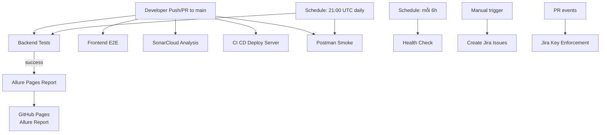

# 📋 KCPM — Tài Liệu Quy Trình CI/CD Chi Tiết

> **Môn**: Kiểm Chứng Phần Mềm | **Team**: UIT Team 36  
> **Cập nhật lần cuối**: 2026-06-13

---

## 📊 Tổng Quan Pipeline

Project KCPM sử dụng **9 GitHub Actions workflows** để tự động hóa toàn bộ quy trình kiểm thử, triển khai, và báo cáo.



---

## 🔄 Workflow #1: Backend Tests (`backend-tests.yml`)

### Thông tin cơ bản
| Thuộc tính | Giá trị |
|-----------|---------|
| **Trigger** | `push` main, `pull_request` main, `schedule` (21:00 UTC daily), `workflow_dispatch` |
| **Runner** | `windows-latest` |
| **Run hiện tại** | #457+ |
| **Thời gian chạy** | ~5-7 phút |

### Jobs & Steps chi tiết

**Job: `test`**

| Step # | Step Name | Mô tả chi tiết |
|--------|-----------|----------------|
| 1 | Checkout code | Clone repo với `fetch-depth: 0` (full history cho blame) |
| 2 | Setup .NET | Cài đặt .NET 8.0.x với cache NuGet |
| 3 | Setup Java | Cài JDK 17 (Temurin) cho Allure CLI |
| 4 | Install Allure CLI | `npm install -g allure-commandline` |
| 5 | Restore packages | `dotnet restore` cho test project |
| 6 | **Run tests** | `dotnet test` với XPlat Code Coverage, TRX logger, runsettings |
| 7 | Write Allure metadata | Tạo `environment.properties` + `executor.json` cho Allure |
| 8 | Generate Allure report | `allure generate` từ allure-results |
| 9 | Write Allure widgets | Ghi environment.json vào widgets folder |
| 10 | Upload test results | Upload TRX + allure-report artifact (30 ngày) |
| 11 | **Generate Coverage Report** | `dotnet-reportgenerator-globaltool`: tạo HTML coverage, badges, TextSummary, JsonSummary |
| 12 | Upload coverage report | Upload coverage-report artifact (30 ngày) |
| 13 | **Publish coverage badges** | Lưu badge JSON → checkout gh-pages → push badges/ → shields.io endpoint |
| 14 | **Write Step Summary** | Parse TRX → hiện Pass/Fail/Coverage trong GitHub Actions tab |
| 15 | **Log to Jira** | Parse TRX → gọi `jira_log_test_execution.py` → log kết quả lên Jira board |
| 16 | Upload Allure results | Upload allure-results + history (30 ngày) |

### Output
- ✅ xUnit test results (TRX format)
- 📊 Code coverage report (HTML + badges)
- 📈 Coverage badges trên GitHub Pages (`/badges/coverage-badge.json`)
- 🎯 Allure results artifact
- 📋 Jira test execution log
- 📄 GitHub Step Summary với bảng coverage

---

## 🌐 Workflow #2: Frontend E2E (`frontend-e2e.yml`)

### Thông tin cơ bản
| Thuộc tính | Giá trị |
|-----------|---------|
| **Trigger** | `push` main, `pull_request` main, `workflow_dispatch` |
| **Runner** | `ubuntu-latest` |
| **Framework** | CodeceptJS + Playwright (Chromium headless) |
| **Run hiện tại** | #106+ |

### Jobs & Steps chi tiết

**Job: `e2e`** (working-directory: `Waste-Recycling-Platform/frontend`)

| Step # | Step Name | Mô tả chi tiết |
|--------|-----------|----------------|
| 1 | Checkout code | Clone repo |
| 2 | Setup Node.js | Node 20 với npm cache |
| 3 | Install dependencies | `npm install --omit=optional` |
| 4 | Install Playwright | `npx playwright install --with-deps chromium` |
| 5 | **Run CodeceptJS E2E** | `npm run e2e:ci` (continue-on-error) |
| 6 | Write Allure metadata | Tạo executor.json + environment.properties |
| 7 | Install Allure CLI | Cài allure-commandline |
| 8 | Generate Allure report | `allure generate` → local check |
| 9 | Upload E2E Allure results | Artifact cho merged report |
| 10 | Upload E2E artifacts | Screenshots + report (30 ngày) |
| 11 | **Log to Jira** | Parse allure summary → `jira_log_test_execution.py` |

### Output
- 🖼️ Screenshots (test failures)
- 📊 Allure results (merged vào main report)
- 📋 Jira test execution log

---

## 🔍 Workflow #3: SonarCloud Analysis (`sonar.yml`)

### Thông tin cơ bản
| Thuộc tính | Giá trị |
|-----------|---------|
| **Trigger** | `push` main, `pull_request`, `workflow_dispatch` |
| **Project Key** | `chi-trung_KCPM` |
| **Dashboard** | https://sonarcloud.io/summary/overall?id=chi-trung_KCPM |

### Jobs chi tiết

**Job 1: `sonar-backend`** (SonarCloud Backend .NET)

| Step # | Step Name | Mô tả |
|--------|-----------|-------|
| 1 | Checkout code | fetch-depth: 0 cho blame data |
| 2 | Setup .NET | .NET 8.0.x |
| 3 | Setup JDK 17 | Cho SonarScanner |
| 4 | Cache SonarCloud | Cache `.sonar/cache` |
| 5 | Install SonarScanner | `dotnet tool install --global dotnet-sonarscanner` |
| 6 | Install coverlet | Coverage tool |
| 7 | Restore dependencies | NuGet restore |
| 8 | Move sonar-project.properties | Tạm di chuyển (không tương thích dotnet-sonarscanner) |
| 9 | **Begin SonarCloud scan** | Bắt đầu scan với OpenCover coverage paths |
| 10 | Build backend | `dotnet build` Release |
| 11 | **Run tests with coverage** | `dotnet test` với Coverlet OpenCover format |
| 12 | **End SonarCloud scan** | Upload kết quả lên SonarCloud |
| 13 | Restore properties | Di chuyển file về vị trí cũ |

**Job 2: `sonar-frontend`** (SonarCloud Frontend JS)

| Step # | Step Name | Mô tả |
|--------|-----------|-------|
| 1 | Checkout code | Full history |
| 2 | Setup Node.js | Node 20 |
| 3 | Install dependencies | npm install |
| 4 | Run unit tests | Jest coverage (nếu có) |
| 5 | **SonarCloud Scan** | `SonarSource/sonarcloud-github-action` với sources/tests/exclusions |

### Output
- 🔍 Static analysis (bugs, vulnerabilities, code smells)
- 📊 Coverage upload (nếu có)
- ✅ Quality Gate status

---

## 📬 Workflow #4: Postman Smoke Tests (`postman-smoke.yml`)

### Thông tin cơ bản
| Thuộc tính | Giá trị |
|-----------|---------|
| **Trigger** | `workflow_dispatch`, `pull_request`, `schedule` (21:00 UTC daily) |
| **Runner** | `ubuntu-latest` (shell: pwsh) |
| **Tool** | Newman + Docker Compose |

### Jobs & Steps chi tiết

**Job: `smoke`**

| Step # | Step Name | Mô tả |
|--------|-----------|-------|
| 1 | Checkout | Clone repo |
| 2 | **Extract Jira key** | Tìm KIEM-XX từ PR title / branch / commit message |
| 3 | Docker Buildx | Setup buildx |
| 4 | Build Backend image | Docker build với cache (GHA) |
| 5 | Start backend stack | `docker compose up -d db backend` |
| 6 | Show container status | Debug output |
| 7 | **Wait for API health** | Retry 60 lần × 5s timeout |
| 8 | Install Newman | `newman + newman-reporter-junitfull + newman-reporter-allure` |
| 9 | Decide scope | smoke vs all (auto smoke cho non-dispatch) |
| 10 | **Pre-login** | Login với 4 roles: citizen, enterprise, admin, collector → lấy JWT tokens |
| 11 | **Run Postman collection** | Newman run với JWT tokens, CLI+JUnit+JSON+Allure reporters |
| 12 | Export Allure results | Copy allure results + write executor.json |
| 13 | Upload results | Artifact upload |
| 14 | **Resolve Jira Key** | Xác nhận KIEM-XX tồn tại trên Jira API |
| 15 | **Comment PASS to Jira** | Tự động comment kết quả lên Jira issue |
| 16 | **Transition Jira status** | PASS → In Progress (push), PASS+merged → Done |
| 17 | Comment FAIL to Jira | Nếu fail → comment fail lên Jira |
| 18 | Dump backend logs | Nếu failure → show Docker logs |
| 19 | Debug state | Show workflow state |
| 20 | **Fail workflow** | Nếu Newman fail → đánh dấu workflow failed |
| 21 | Stop backend | `docker compose down -v` |
| 22 | **Log to Jira** | `jira_log_test_execution.py` với pass/fail counts |

### Output
- ✅/❌ Newman test results
- 📋 Jira comments (auto PASS/FAIL)
- 🔄 Jira status transitions
- 📊 Allure results cho merged report

---

## 📊 Workflow #5: Allure Pages Report (`allure-gh-pages.yml`)

### Thông tin cơ bản
| Thuộc tính | Giá trị |
|-----------|---------|
| **Trigger** | Sau `Backend Tests` thành công (workflow_run), `workflow_dispatch` |
| **Output** | https://chi-trung.github.io/KCPM/report-main/ |

### Jobs & Steps chi tiết (535 dòng - workflow phức tạp nhất!)

**Job: `run-api-tests`**

| Step # | Step Name | Mô tả |
|--------|-----------|-------|
| 1 | Checkout code | Full repo |
| 2 | Docker Buildx | Setup builder |
| 3 | Build Backend image | Docker build + GHA cache |
| 4 | Start Backend | Docker Compose up backend |
| 5 | Setup Node.js | Node 18 |
| 6 | Install Newman + Allure | Newman + newman-reporter-allure |
| 7 | **Run Postman Tests** | Newman run full collection → allure-results |
| 8 | Checkout gh-pages | Lấy history từ gh-pages branch |
| 9 | **Fetch backend-tests artifact** | Tải allure-results từ Backend Tests run gần nhất |
| 10 | **Fetch frontend E2E artifact** | Tải e2e-allure-results → merge vào main report |
| 11 | Restore Allure History | Copy history từ gh-pages |
| 12 | Write Environment | environment.properties cho Allure |
| 13 | Write executor metadata | executor.json |
| 14 | Write categories | Copy allure-categories.json |
| 15 | **Sync Jira Owners** | `sync_jira_owners.py` → lấy owner từ Jira |
| 16 | **Inject owners** | `inject_owners_into_results.py` → gắn owner vào test results |
| 17 | Debug merged results | Show merged allure-results tree |
| 18 | **Normalize suites** | `normalize_allure_suites.py` → nhóm thành E2E/Postman/xUnit |
| 19 | Copy categories | categories.json vào results + gh-pages |
| 20 | **Generate Allure Report** | `simple-elf/allure-report-action` → report-main |
| 21 | Debug report | Verify generated report |
| 22 | Normalize permissions | Fix root-owned Docker files |
| 23 | **Build custom categories** | `build_categories_report.py` |
| 24 | Install Allure CLI | Cho per-owner reports |
| 25 | **Generate per-owner reports** | `generate_per_owner_reports.py` → report theo từng thành viên |
| 26 | Install Playwright | Cho PDF export |
| 27 | **Export PDF reports** | Playwright → render Allure HTML → PDF |
| 28 | Create validation artifacts | `create_validation_artifacts.py` |
| 29 | **Build validation page** | `build_validation_page.py` → trang kiểm tra kết quả |
| 30 | Assemble site | Gộp report-main + report-extra + index |
| 31 | **Deploy to GitHub Pages** | `peaceiris/actions-gh-pages` → publish |
| 32 | Persist history | Push last-history vào gh-pages |

### Output
- 📊 Allure Report tại https://chi-trung.github.io/KCPM/report-main/
- 👤 Per-owner reports (report-extra/owners/)
- 📄 PDF export (manual trigger)
- ✅ Validation page
- 📈 History trend (20 runs gần nhất)

---

## 🚀 Workflow #6: CI CD Deploy Server (`deploy-server.yml`)

### Thông tin cơ bản
| Thuộc tính | Giá trị |
|-----------|---------|
| **Trigger** | `push` main, `workflow_dispatch` |
| **Runner** | `ubuntu-latest` |

### Jobs chi tiết

**Job 1: `quality-gate`** — Chạy tất cả tests trước khi deploy

| Step # | Step Name | Mô tả |
|--------|-----------|-------|
| 1-5 | Setup | .NET 8 + Java 17 + Allure CLI |
| 6 | **Backend tests** | `dotnet test` Release |
| 7 | Generate Allure | Backend allure report |
| 8 | Upload results | Quality gate artifacts |
| 9-12 | **Frontend E2E gate** | Node 20 + Playwright + CodeceptJS |
| 13-14 | **Docker stack** | Build + start backend + DB |
| 15 | Health check | Wait for API healthy |
| 16 | **Postman smoke gate** | Newman smoke folder |
| 17 | Upload Postman | Postman artifacts |
| 18 | Stop stack | Docker compose down |

**Job 2: `deploy`** (depends on quality-gate)

| Step # | Step Name | Mô tả |
|--------|-----------|-------|
| 1 | Check secrets | Verify DEPLOY_HOST, DEPLOY_USER, DEPLOY_SSH_KEY |
| 2 | **Deploy via SSH** | `appleboy/ssh-action` → git pull + docker compose up --build |
| 3 | Summary | Deployment log |

---

---

## 🏥 Workflow #7: Health Check (`health-check.yml`)

### Thông tin cơ bản
| Thuộc tính | Giá trị |
|-----------|---------|
| **Trigger** | `schedule` mỗi 6h, `workflow_dispatch` |
| **Mục đích** | Monitor uptime + giữ Render free tier warm |

### Steps
| Step # | Service | URL |
|--------|---------|-----|
| 1 | Backend API | https://kcpm-backend.onrender.com/api/health |
| 2 | Frontend | https://kcpm.vercel.app/ |
| 3 | Swagger | https://kcpm-backend.onrender.com/swagger/index.html |
| 4 | Allure Report | https://chi-trung.github.io/KCPM/report-main/ |
| 5 | Summary | Bảng tổng kết trong Step Summary |

---

## 🔑 Workflow #8: Jira Key Enforcement (`jira-key-enforcement.yml`)

### Thông tin cơ bản
| Thuộc tính | Giá trị |
|-----------|---------|
| **Trigger** | `pull_request` (opened, edited, synchronize, reopened) |
| **Mục đích** | Bắt buộc PR title + commit messages phải có Jira key |

### Jobs

**Job 1: `pr-title-must-have-jira-key`**
- Validate PR title match regex `/[A-Z][A-Z0-9]+-\d+/`
- Ví dụ: "KIEM-123 - Implement report validation" ✅
- Ví dụ: "Fix bug" ❌

**Job 2: `commits-must-have-jira-key`**
- Kiểm tra tất cả commit messages trong PR
- Skip merge commits (auto-generated)
- Liệt kê commits thiếu Jira key

---

## 📋 Workflow #9: Create Jira Issues (`create-jira-issues.yml`)

| Thuộc tính | Giá trị |
|-----------|---------|
| **Trigger** | `workflow_dispatch` (manual only) |
| **Script** | `scripts/create_jira_issues.py` |
| **Input** | Optional `epic_issue_key` để link tasks |

Tạo Jira issues tự động từ test plan definition trong project.

---

---

## 🔗 Chuỗi Phụ Thuộc (Dependency Chain)

```
push/PR to main
    ├── Backend Tests ──────→ [success] ──→ Allure Pages Report
    ├── Frontend E2E ────────────────────→ (artifacts merged vào Allure)
    ├── SonarCloud Analysis
    ├── CI CD Deploy Server (quality-gate → deploy)
    └── Postman Smoke (nếu PR/schedule)

Schedule (mỗi 6h):
    └── Health Check → monitor + keep Render warm

Schedule (21:00 UTC daily):
    ├── Backend Tests
    └── Postman Smoke

PR events:
    └── Jira Key Enforcement
```

---

## 🛠️ Scripts hỗ trợ

| Script | Mục đích |
|--------|----------|
| `scripts/jira_log_test_execution.py` | Log kết quả test lên Jira |
| `scripts/create_jira_issues.py` | Tạo Jira issues tự động |
| `scripts/sync_jira_owners.py` | Đồng bộ owner từ Jira |
| `scripts/inject_owners_into_results.py` | Gắn owner vào Allure results |
| `scripts/normalize_allure_suites.py` | Nhóm tests → 3 suite (E2E/Postman/xUnit) |
| `scripts/build_categories_report.py` | Tạo custom categories cho Allure |
| `scripts/generate_per_owner_reports.py` | Tạo Allure report theo từng thành viên |
| `scripts/build_validation_page.py` | Tạo trang validation |
| `scripts/build_site_index.py` | Build site index cho GitHub Pages |
| `scripts/create_validation_artifacts.py` | Tạo artifacts cho validation |

---

## 🌍 Môi Trường Triển Khai

| Environment | Platform | URL |
|------------|----------|-----|
| **Frontend** | Vercel | https://kcpm.vercel.app |
| **Backend** | Render.com | https://kcpm-backend.onrender.com |
| **Database** | Aiven MySQL | (private connection string) |
| **Allure Report** | GitHub Pages | https://chi-trung.github.io/KCPM/report-main/ |
| **SonarCloud** | SonarCloud | https://sonarcloud.io/summary/overall?id=chi-trung_KCPM |
| **Jira Board** | Atlassian | https://ut-team-36.atlassian.net/jira/software/projects/KIEM |

---

## 🔐 GitHub Secrets cần thiết

| Secret | Dùng cho |
|--------|----------|
| `SONAR_TOKEN` | SonarCloud authentication |
| `JIRA_BASE_URL` | Jira API base URL |
| `JIRA_API_EMAIL` | Jira API email |
| `JIRA_API_TOKEN` | Jira API token |

| `DEPLOY_HOST` | SSH deploy target host |
| `DEPLOY_USER` | SSH deploy username |
| `DEPLOY_SSH_KEY` | SSH deploy private key |
| `DEPLOY_REPO_TOKEN` | Git clone token for deploy server |
| `MYSQL_*` | Database credentials |
| `JWT_*` | JWT authentication settings |
