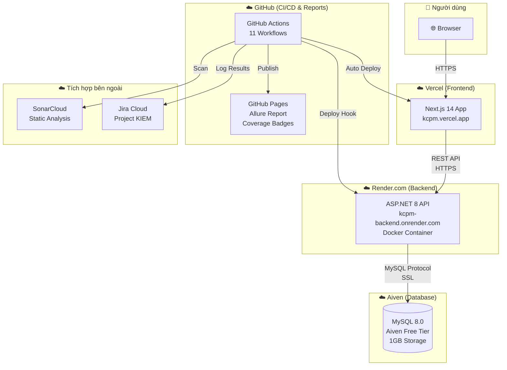
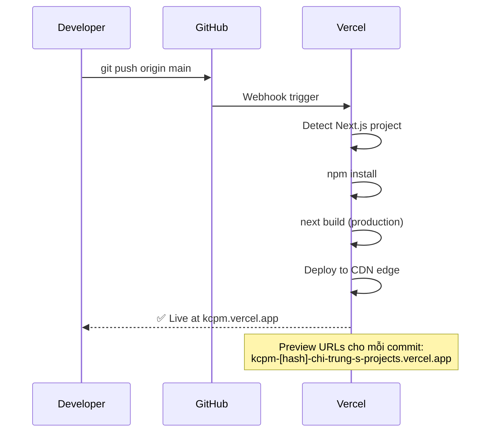
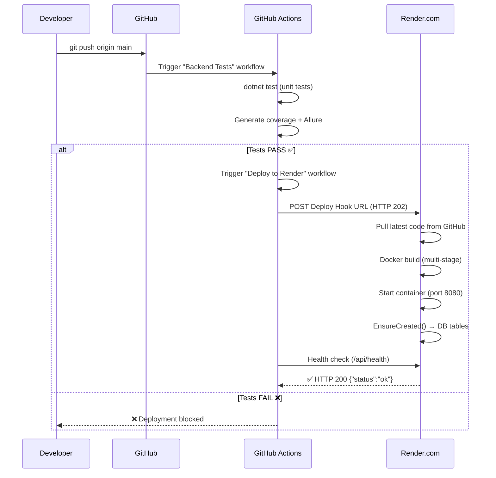
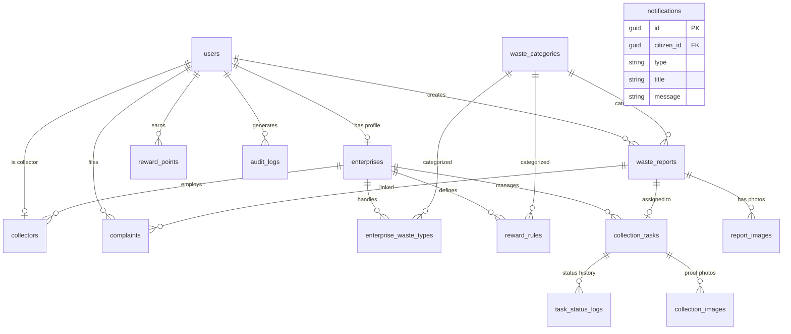
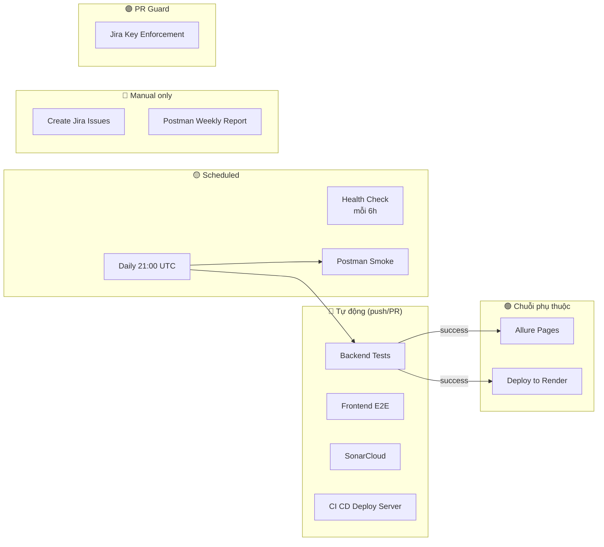
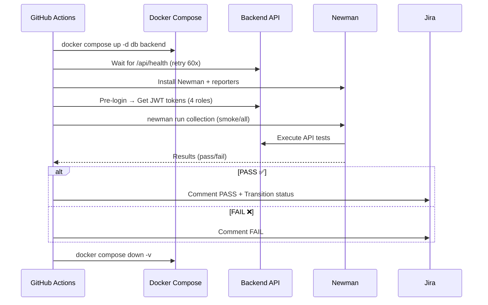
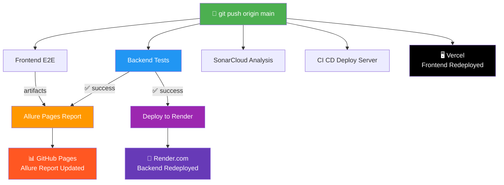

# 🚀 KCPM — Tài Liệu Triển Khai & Hạ Tầng Toàn Diện

> **Môn**: Kiểm Chứng Phần Mềm | **Team**: UIT Team 36
> **Cập nhật lần cuối**: 2026-06-13
> **Repository**: https://github.com/chi-trung/KCPM

---

## 📐 Kiến Trúc Tổng Quan Hệ Thống



---

## 🏗️ Các Thành Phần & Nơi Deploy

### Bảng tổng hợp

| Thành phần | Nền tảng | URL Production | Branch | Phương thức Deploy |
|-----------|----------|---------------|--------|-------------------|
| **Frontend** | Vercel | https://kcpm.vercel.app | `main` | Auto deploy khi push |
| **Backend API** | Render.com | https://kcpm-backend.onrender.com | `main` | Deploy Hook từ GitHub Actions |
| **Database** | Aiven MySQL | *(private connection)* | — | Persistent, EF Core auto-create |
| **Allure Report** | GitHub Pages | https://chi-trung.github.io/KCPM/report-main/ | `gh-pages` | Auto publish sau Backend Tests |
| **Coverage Badges** | GitHub Pages | https://chi-trung.github.io/KCPM/badges/ | `gh-pages` | Auto update sau Backend Tests |
| **Swagger API Docs** | Render.com | https://kcpm-backend.onrender.com/swagger | `main` | Đi kèm Backend |
| **SonarCloud** | SonarCloud | https://sonarcloud.io/summary/overall?id=chi-trung_KCPM | — | Auto scan khi push/PR |
| **Jira Board** | Atlassian | https://ut-team-36.atlassian.net/jira/software/projects/KIEM | — | Auto update từ CI |

---

## 🖥️ 1. Frontend — Vercel

### Thông tin chi tiết

| Thuộc tính | Giá trị |
|-----------|---------|
| **Framework** | Next.js 14 (App Router) |
| **Hosting** | Vercel (Free Tier) |
| **Domain chính** | `kcpm.vercel.app` |
| **Repository** | `chi-trung/KCPM` |
| **Root Directory (Vercel)** | `Waste-Recycling-Platform/frontend` |
| **Build Command** | `next build` (auto-detected) |
| **Output Directory** | `.next` (auto-detected) |
| **Node.js Version** | 20.x |

### Cấu hình `vercel.json`

```json
{
  "git": {
    "deploymentEnabled": {
      "main": true,
      "gh-pages": false
    }
  }
}
```

> **Lưu ý**: `gh-pages` bị tắt deploy vì branch này chứa Allure Report + Coverage Badges, không phải frontend app.

### Environment Variables (Vercel Dashboard)

| Variable | Giá trị | Môi trường |
|----------|---------|-----------|
| `NEXT_PUBLIC_API_URL` | `https://kcpm-backend.onrender.com` | Production, Preview, Development |

### Cách API URL được sử dụng

```
.env.production (fallback) → NEXT_PUBLIC_API_URL=https://kcpm-backend.onrender.com
Vercel Dashboard (ưu tiên) → NEXT_PUBLIC_API_URL=https://kcpm-backend.onrender.com
                                  ↓
frontend/src/lib/api/config.ts → BASE_URL = NEXT_PUBLIC_API_URL + "/api"
                                  ↓
         Mọi API call đều đi qua → https://kcpm-backend.onrender.com/api/...
```

### Luồng Deploy Frontend



### Troubleshooting Frontend

| Vấn đề | Nguyên nhân | Cách fix |
|--------|-------------|---------|
| 404 trên Vercel | `output: 'standalone'` trong next.config.js | Chỉ set standalone khi `DOCKER_BUILD=true` |
| API call bị CORS | Backend chưa whitelist domain Vercel | Đã fix: `SetIsOriginAllowed` cho `*.vercel.app` |
| Sai API URL | Vercel env var override `.env.production` | Kiểm tra Vercel Dashboard → Settings → Environment Variables |
| `gh-pages` branch lỗi build | Vercel auto-deploy tất cả branches | Đã fix: `vercel.json` disable `gh-pages` |

---

## ⚙️ 2. Backend API — Render.com

### Thông tin chi tiết

| Thuộc tính | Giá trị |
|-----------|---------|
| **Framework** | ASP.NET 8 (Minimal API + Controllers) |
| **Hosting** | Render.com Web Service (Free Tier) |
| **Domain** | `kcpm-backend.onrender.com` |
| **Runtime** | Docker (multi-stage build) |
| **Root Directory (Render)** | `Waste-Recycling-Platform/backend` |
| **Dockerfile** | `Waste-Recycling-Platform/backend/Dockerfile` |
| **Region** | Singapore |
| **Health Check** | `GET /api/health` |
| **Port** | 8080 (HTTP) |

### Dockerfile (Multi-stage Build)

```dockerfile
# Stage 1: Build (.NET SDK 8.0)
FROM mcr.microsoft.com/dotnet/sdk:8.0 AS build
WORKDIR /src
COPY *.csproj → dotnet restore → dotnet publish -c Release

# Stage 2: Runtime (.NET ASP.NET 8.0)
FROM mcr.microsoft.com/dotnet/aspnet:8.0 AS runtime
COPY --from=build /app/publish .
EXPOSE 8080
ENTRYPOINT ["dotnet", "WastePlatform.API.dll"]
```

### Environment Variables (Render Dashboard)

| Variable | Giá trị | Mô tả |
|----------|---------|-------|
| `ASPNETCORE_ENVIRONMENT` | `Production` | Môi trường .NET |
| `ASPNETCORE_URLS` | `http://+:8080` | Bind port |
| `ConnectionStrings__DefaultConnection` | `Server=...;Port=...;Database=defaultdb;...` | Aiven MySQL connection string |
| `JwtSettings__SecretKey` | *(auto-generated)* | JWT signing key |
| `JwtSettings__Issuer` | `WastePlatform` | JWT issuer |
| `JwtSettings__Audience` | `WastePlatformClient` | JWT audience |
| `FrontendUrls` | *(optional)* | Thêm domain CORS ngoài Vercel |

### Blueprint IaC (`render.yaml`)

```yaml
services:
  - type: web
    name: kcpm-backend
    runtime: docker
    repo: https://github.com/chi-trung/KCPM
    rootDir: Waste-Recycling-Platform/backend
    dockerfilePath: ./Dockerfile
    plan: free
    region: singapore
    branch: main
    healthCheckPath: /api/health
```

### CORS Configuration (Program.cs)

Backend cho phép các origin sau gọi API:

```
✅ http://localhost:3000                 (local dev)
✅ https://kcpm.vercel.app              (production)
✅ https://kcpm-ecru.vercel.app         (production alt)
✅ https://*.vercel.app                 (preview deployments)
✅ Bất kỳ URL nào trong env var FrontendUrls (tùy chỉnh)
```

### Database Auto-Migration (Program.cs)

```csharp
// Khi app khởi động trên Render, tự động tạo tables nếu chưa có
using (var scope = app.Services.CreateScope())
{
    var db = scope.ServiceProvider.GetRequiredService<WastePlatformDbContext>();
    db.Database.EnsureCreated();  // Tạo tables từ EF Core model
}
```

> **Quan trọng**: `EnsureCreated()` chỉ tạo tables mới, KHÔNG update schema. Nếu cần thay đổi schema, phải dùng EF Core Migrations hoặc SQL scripts.

### API Endpoints chính

| Endpoint | Method | Auth | Mô tả |
|----------|--------|------|-------|
| `/api/health` | GET | ❌ | Health check |
| `/api/auth/register` | POST | ❌ | Đăng ký |
| `/api/auth/login` | POST | ❌ | Đăng nhập → JWT |
| `/api/auth/me` | GET | ✅ | Thông tin user hiện tại |
| `/api/auth/roles` | GET | ❌ | Danh sách roles |
| `/api/waste-categories` | GET | ❌ | Danh mục rác |
| `/api/reports` | GET/POST | ✅ | Báo cáo rác |
| `/swagger` | GET | ❌ | Swagger UI (API docs) |
| `/hubs/task` | WebSocket | ✅ | SignalR real-time |

### Luồng Deploy Backend



### Render Free Tier — Lưu ý quan trọng

| Đặc điểm | Chi tiết |
|-----------|---------|
| **Spin-down** | Service tắt sau 15 phút không có request |
| **Cold start** | Khởi động lại mất ~30-60 giây |
| **Giải pháp** | Health Check workflow chạy mỗi 6h giữ service warm |
| **Build time** | Docker build mất ~3-7 phút |
| **Bandwidth** | 100 GB/tháng (đủ cho demo) |

### Troubleshooting Backend

| Vấn đề | Nguyên nhân | Cách fix |
|--------|-------------|---------|
| 500 Internal Server Error | Database tables chưa tồn tại | `EnsureCreated()` đã được thêm (auto) |
| CORS blocked | Origin không nằm trong whitelist | Đã fix: `SetIsOriginAllowed` cho `*.vercel.app` |
| Cold start chậm | Render free tier spin-down | Health Check workflow giữ warm mỗi 6h |
| Deploy hook fail | Workflow chỉ accept 200/201 | Đã fix: thêm 202 Accepted |
| Register trả 500 rỗng | Không có catch-all exception handler | Đã fix: thêm `catch (Exception)` |

---

## 🗄️ 3. Database — Aiven MySQL

### Thông tin chi tiết

| Thuộc tính | Giá trị |
|-----------|---------|
| **Provider** | Aiven.io (Free Tier) |
| **Engine** | MySQL 8.0 |
| **Storage** | 1 GB |
| **Region** | Singapore (gần Render) |
| **SSL** | Required |
| **Database name** | `defaultdb` |

### Connection String Format

```
Server={host};Port={port};Database=defaultdb;User={user};Password={password};SslMode=Required;
```

> Connection string được set **thủ công** trong Render Dashboard → Environment Variables → `ConnectionStrings__DefaultConnection`

### Bảng dữ liệu (15 tables)



### Schema quản lý

| Phương thức | Mô tả | Khi nào dùng |
|------------|-------|-------------|
| **SQL Migration Scripts** | `db/migrations/V1__create_base_tables.sql` ... `V9__e2e_test_accounts.sql` | Docker Compose (local dev) |
| **EF Core EnsureCreated** | Tự động tạo từ `WastePlatformDbContext.OnModelCreating()` | Cloud deploy (Render + Aiven) |
| **Docker entrypoint** | Mount `db/migrations/` vào `/docker-entrypoint-initdb.d` | Docker Compose (local dev) |

---

## 🔄 4. CI/CD Pipeline — GitHub Actions

### Tổng quan 11 Workflows



---

### Workflow #1: `backend-tests.yml` — Backend Tests

```
📌 Trigger:  push main | PR main | schedule 21:00 UTC | manual
🖥️ Runner:  windows-latest
⏱️ Thời gian: ~5-7 phút
```

**Chức năng:**
1. Chạy ~130 unit tests (.NET xUnit)
2. Tạo code coverage report (HTML + badges)
3. Tạo Allure test results
4. Publish coverage badges lên `gh-pages/badges/`
5. Log kết quả lên Jira
6. Trigger workflows phụ thuộc (Allure Pages, Deploy Render)

**Flow chi tiết:**
```
Checkout → Setup .NET 8 + Java 17 → Install Allure CLI
    → dotnet restore → dotnet test (with coverage)
    → Generate Allure report → Upload artifacts
    → Generate coverage badges → Push to gh-pages
    → Write Step Summary → Log to Jira
```

---

### Workflow #2: `frontend-e2e.yml` — Frontend E2E

```
📌 Trigger:  push main | PR main | manual
🖥️ Runner:  ubuntu-latest
🔧 Tools:   CodeceptJS + Playwright (Chromium headless)
```

**Chức năng:**
1. Chạy E2E tests trên frontend (CodeceptJS)
2. Tạo screenshots khi fail
3. Upload Allure results (merge vào main report)
4. Log kết quả lên Jira

---

### Workflow #3: `sonar.yml` — SonarCloud Analysis

```
📌 Trigger:  push main | PR | manual
🖥️ Runner:  ubuntu-latest
📊 Dashboard: https://sonarcloud.io/summary/overall?id=chi-trung_KCPM
```

**2 Jobs song song:**

| Job | Scope | Tool |
|-----|-------|------|
| `sonar-backend` | .NET backend code | dotnet-sonarscanner |
| `sonar-frontend` | JS/TS frontend + E2E | SonarSource/sonarcloud-github-action |

**Phân tích:**
- 🐛 Bugs
- 🔓 Security Vulnerabilities
- 🧹 Code Smells
- 📊 Code Coverage (từ test results)
- ✅ Quality Gate pass/fail

---

### Workflow #4: `postman-smoke.yml` — Postman Smoke Tests

```
📌 Trigger:  manual | PR | schedule 21:00 UTC
🖥️ Runner:  ubuntu-latest (pwsh shell)
🔧 Tools:   Newman + Docker Compose
```

**Flow chi tiết:**


**Jira Integration:**
- Tự động detect Jira key từ PR title / branch / commit
- Comment kết quả PASS/FAIL lên Jira issue
- Transition status: push → In Progress, merged → Done

---

### Workflow #5: `allure-gh-pages.yml` — Allure Pages Report

```
📌 Trigger:  Sau Backend Tests thành công | manual
🖥️ Runner:  ubuntu-latest
📊 Output:   https://chi-trung.github.io/KCPM/report-main/
⚙️ Lines:   536 dòng — workflow phức tạp nhất!
```

**Chức năng chính:**
1. Chạy Postman tests qua Newman + Docker
2. Fetch backend-tests Allure artifact
3. Fetch frontend-e2e Allure artifact
4. **Merge 3 nguồn** (xUnit + Postman + E2E) vào 1 report
5. Sync owners từ Jira → inject vào results
6. Normalize suites (3 nhóm: xUnit / Postman / E2E)
7. Generate per-owner reports
8. Export PDF (manual trigger)
9. Build validation page
10. Deploy lên GitHub Pages

**Output:**
```
https://chi-trung.github.io/KCPM/
├── report-main/          ← Allure Report chính (merged)
├── report-extra/
│   ├── owners/           ← Report theo từng thành viên
│   └── validation/       ← Trang kiểm tra kết quả
├── badges/               ← Coverage badges (shields.io)
└── index.html            ← Trang index
```

---

### Workflow #6: `deploy-server.yml` — CI CD Deploy Server

```
📌 Trigger:  push main | manual (chọn ref)
🖥️ Runner:  ubuntu-latest
🔧 Deploy:  SSH + Docker Compose trên server riêng
```

**2 Jobs tuần tự:**

| Job | Chức năng |
|-----|----------|
| `quality-gate` | Chạy Backend Tests + Frontend E2E + Postman Smoke trước khi deploy |
| `deploy` | SSH vào server → git pull → docker compose up --build |

> **Lưu ý**: Job `deploy` cần SSH secrets (`DEPLOY_HOST`, `DEPLOY_USER`, `DEPLOY_SSH_KEY`). Nếu chưa set → skip deploy.

---

### Workflow #7: `deploy-render.yml` — Deploy to Render

```
📌 Trigger:  Sau Backend Tests thành công | manual
🎯 Target:   https://kcpm-backend.onrender.com
```

**Steps:**
```
1. Check RENDER_DEPLOY_HOOK_URL secret
2. POST Deploy Hook → Render starts rebuild (HTTP 202)
3. Wait 120s for Docker build
4. Health check: 5 retries × 30s → /api/health
5. Write deployment summary
```

---

### Workflow #8: `health-check.yml` — Deployment Health Check

```
📌 Trigger:  schedule mỗi 6 giờ | manual
🎯 Mục đích: Monitor uptime + giữ Render free tier warm
```

**Kiểm tra 4 services:**

| # | Service | URL | Timeout |
|---|---------|-----|---------|
| 1 | Backend API | https://kcpm-backend.onrender.com/api/health | 30s |
| 2 | Frontend | https://kcpm.vercel.app/ | 15s |
| 3 | Swagger UI | https://kcpm-backend.onrender.com/swagger/index.html | 15s |
| 4 | Allure Report | https://chi-trung.github.io/KCPM/report-main/ | 15s |

---

### Workflow #9: `jira-key-enforcement.yml` — Jira Key Enforcement

```
📌 Trigger:  PR events (opened, edited, synchronize, reopened)
🎯 Mục đích: Bắt buộc mọi PR title + commit phải có Jira key
```

**Rules:**
- PR title phải match `/[A-Z][A-Z0-9]+-\d+/` → VD: `KIEM-123 - Fix bug`
- Mọi commit message trong PR phải có Jira key
- Skip merge commits tự động

---

### Workflow #10: `create-jira-issues.yml` — Create Jira Issues

```
📌 Trigger:  manual only
🎯 Mục đích: Tạo Jira issues tự động từ test plan
```

---

### Workflow #11: `postman-weekly-report.yml` — Postman Weekly Report

```
📌 Trigger:  manual only
🎯 Mục đích: Chạy full Postman collection + upload evidence
```

---

## 🔗 5. Chuỗi Phụ Thuộc & Luồng Tự Động

### Khi push code lên `main`



### Timeline sau khi push

```
t=0s     Developer pushes to main
t=5s     GitHub Actions triggered:
           ├── Backend Tests (windows-latest, ~5-7 min)
           ├── Frontend E2E (ubuntu-latest, ~3-5 min)
           ├── SonarCloud Analysis (ubuntu-latest, ~4-6 min)
           └── CI CD Deploy Server (ubuntu-latest, ~10 min)
         Vercel auto-deploy triggered (~1-2 min)

t=60s    Vercel: Frontend live ✅

t=5min   Backend Tests: PASS ✅
           ├── Triggers: Deploy to Render
           └── Triggers: Allure Pages Report

t=7min   Render: Backend rebuild started (Docker ~3-5 min)

t=10min  Render: Backend live ✅
         Allure Pages: Report published ✅

t=15min  All deployments complete ✅
```

---

## 🔐 6. GitHub Secrets

### Danh sách đầy đủ

| Secret | Workflow(s) | Mô tả | Bắt buộc? |
|--------|------------|-------|-----------|
| **`SONAR_TOKEN`** | SonarCloud | SonarCloud authentication token | ✅ Cho static analysis |
| **`RENDER_DEPLOY_HOOK_URL`** | Deploy to Render | Render.com Deploy Hook URL | ✅ Cho auto deploy backend |
| **`JIRA_BASE_URL`** | Postman Smoke, Backend Tests, Frontend E2E, Allure Pages | VD: `https://ut-team-36.atlassian.net` | ✅ Cho Jira integration |
| **`JIRA_API_EMAIL`** | (same as above) | Email tài khoản Atlassian | ✅ Cho Jira integration |
| **`JIRA_API_TOKEN`** | (same as above) | Jira API token | ✅ Cho Jira integration |
| **`DEPLOY_HOST`** | CI CD Deploy Server | IP/hostname server SSH | ⚠️ Chỉ cho self-hosted deploy |
| **`DEPLOY_USER`** | CI CD Deploy Server | SSH username | ⚠️ Chỉ cho self-hosted deploy |
| **`DEPLOY_SSH_KEY`** | CI CD Deploy Server | SSH private key | ⚠️ Chỉ cho self-hosted deploy |
| **`DEPLOY_REPO_TOKEN`** | CI CD Deploy Server | GitHub PAT cho git clone trên server | ⚠️ Chỉ cho self-hosted deploy |
| **`MYSQL_ROOT_PASSWORD`** | CI CD Deploy Server | MySQL root password | ⚠️ Chỉ cho self-hosted deploy |
| **`MYSQL_DATABASE`** | CI CD Deploy Server | MySQL database name | ⚠️ Chỉ cho self-hosted deploy |
| **`MYSQL_USER`** | CI CD Deploy Server | MySQL username | ⚠️ Chỉ cho self-hosted deploy |
| **`MYSQL_PASSWORD`** | CI CD Deploy Server | MySQL password | ⚠️ Chỉ cho self-hosted deploy |
| **`JWT_SECRET`** | CI CD Deploy Server | JWT signing key | ⚠️ Chỉ cho self-hosted deploy |

### Cách lấy Render Deploy Hook URL

```
1. Đăng nhập https://dashboard.render.com
2. Chọn service "kcpm-backend"
3. Settings → Deploy Hook
4. Copy URL → Add vào GitHub Secrets: RENDER_DEPLOY_HOOK_URL
```

---

## 📜 7. Scripts Hỗ Trợ

| Script | Đường dẫn | Workflow sử dụng | Mô tả |
|--------|-----------|-----------------|-------|
| `jira_log_test_execution.py` | `scripts/` | Backend Tests, Postman Smoke, Frontend E2E, Weekly Report | Log kết quả test lên Jira |
| `create_jira_issues.py` | `scripts/` | Create Jira Issues | Tạo Jira issues tự động |
| `sync_jira_owners.py` | `Waste-Recycling-Platform/scripts/` | Allure Pages | Đồng bộ owner từ Jira API |
| `inject_owners_into_results.py` | `Waste-Recycling-Platform/scripts/` | Allure Pages | Gắn owner vào Allure JSON results |
| `normalize_allure_suites.py` | `Waste-Recycling-Platform/scripts/` | Allure Pages | Nhóm tests → 3 suite (xUnit/Postman/E2E) |
| `build_categories_report.py` | `Waste-Recycling-Platform/scripts/` | Allure Pages | Tạo custom categories cho Allure |
| `generate_per_owner_reports.py` | `Waste-Recycling-Platform/scripts/` | Allure Pages | Allure report riêng theo thành viên |
| `build_validation_page.py` | `Waste-Recycling-Platform/scripts/` | Allure Pages | Trang validation kết quả |
| `build_site_index.py` | `Waste-Recycling-Platform/scripts/` | Allure Pages | Build index.html cho GitHub Pages |
| `create_validation_artifacts.py` | `Waste-Recycling-Platform/scripts/` | Allure Pages | Tạo artifacts cho validation |
| `inject_categories.py` | `scripts/` | — | Inject waste categories vào DB |

---

## 🏗️ 8. Cấu Trúc Thư Mục Liên Quan Deploy

```
KCPM/
├── .github/
│   └── workflows/
│       ├── backend-tests.yml           # Unit tests + coverage
│       ├── frontend-e2e.yml            # E2E tests (CodeceptJS)
│       ├── sonar.yml                   # SonarCloud analysis
│       ├── postman-smoke.yml           # API tests (Newman)
│       ├── allure-gh-pages.yml         # Merged Allure report
│       ├── deploy-render.yml           # Deploy backend to Render
│       ├── deploy-server.yml           # Deploy to self-hosted server
│       ├── health-check.yml            # Uptime monitor
│       ├── jira-key-enforcement.yml    # PR/commit Jira key check
│       ├── create-jira-issues.yml      # Create Jira issues
│       └── postman-weekly-report.yml   # Weekly test report
│
├── Waste-Recycling-Platform/
│   ├── backend/
│   │   ├── Dockerfile                  # Multi-stage .NET 8 build
│   │   └── src/WastePlatform.API/
│   │       ├── Program.cs              # CORS, DB auto-migration, middleware
│   │       ├── appsettings.json        # Local dev config
│   │       └── Controllers/            # API endpoints
│   │
│   ├── frontend/
│   │   ├── vercel.json                 # Vercel: disable gh-pages deploy
│   │   ├── .env.production             # Fallback API URL
│   │   └── src/lib/api/config.ts       # API URL resolution
│   │
│   ├── render.yaml                     # Render.com Blueprint (IaC)
│   ├── docker-compose.yml              # Local dev + CI environments
│   │
│   └── db/migrations/                  # SQL migration scripts
│       ├── V1__create_base_tables.sql
│       ├── V2__add_indexes.sql
│       ├── V3__add_triggers_and_views.sql
│       ├── V4__insert_waste_categories.sql
│       └── ...
│
├── scripts/                            # Python scripts cho CI
│   ├── jira_log_test_execution.py
│   └── create_jira_issues.py
│
└── docs/
    ├── DEPLOYMENT_GUIDE.md             # 📌 Tài liệu này
    ├── CI_CD_WORKFLOWS.md              # Chi tiết workflows
    ├── TESTING_STRATEGY.md             # Chiến lược test
    └── HISTORY_CHAT.md                 # Lịch sử phiên làm việc
```

---

## 🔧 9. Hướng Dẫn Setup Từ Đầu

### Bước 1: Fork/Clone Repository

```bash
git clone https://github.com/chi-trung/KCPM.git
cd KCPM
```

### Bước 2: Setup Database (Aiven)

1. Đăng ký https://aiven.io (free tier)
2. Tạo MySQL service (region: Singapore)
3. Copy connection string

### Bước 3: Deploy Backend (Render.com)

1. Đăng ký https://render.com
2. New → Web Service → Connect GitHub repo `chi-trung/KCPM`
3. Settings:
   - **Root Directory**: `Waste-Recycling-Platform/backend`
   - **Runtime**: Docker
   - **Region**: Singapore
   - **Plan**: Free
4. Environment Variables:
   ```
   ASPNETCORE_ENVIRONMENT = Production
   ASPNETCORE_URLS = http://+:8080
   ConnectionStrings__DefaultConnection = Server=...;Port=...;Database=defaultdb;User=...;Password=...;SslMode=Required;
   JwtSettings__SecretKey = <your-secret-key>
   JwtSettings__Issuer = WastePlatform
   JwtSettings__Audience = WastePlatformClient
   ```
5. Deploy → Wait for health check → Done!
6. Copy Deploy Hook URL → Add to GitHub Secrets

### Bước 4: Deploy Frontend (Vercel)

1. Đăng ký https://vercel.com
2. New Project → Import `chi-trung/KCPM`
3. Settings:
   - **Root Directory**: `Waste-Recycling-Platform/frontend`
   - **Framework**: Next.js (auto-detected)
4. Environment Variables:
   ```
   NEXT_PUBLIC_API_URL = https://kcpm-backend.onrender.com
   ```
5. Deploy → Done!

### Bước 5: Setup GitHub Secrets

Vào repo → Settings → Secrets and variables → Actions → New repository secret:

| Secret | Value |
|--------|-------|
| `RENDER_DEPLOY_HOOK_URL` | (từ Render Dashboard) |
| `SONAR_TOKEN` | (từ SonarCloud) |
| `JIRA_BASE_URL` | `https://ut-team-36.atlassian.net` |
| `JIRA_API_EMAIL` | (email Atlassian) |
| `JIRA_API_TOKEN` | (từ Atlassian Account Settings → API tokens) |

### Bước 6: Verify

```bash
# Test Backend
curl https://kcpm-backend.onrender.com/api/health
# Expected: {"status":"ok"}

# Test Frontend
curl -sI https://kcpm.vercel.app | head -5
# Expected: HTTP/2 200

# Test Swagger
# Open: https://kcpm-backend.onrender.com/swagger
```

---

## ❓ 10. FAQ — Câu Hỏi Thường Gặp

### Q: Tại sao đăng ký không được trên production?
**A**: Có 3 nguyên nhân đã fix (Session 6):
1. CORS chỉ cho localhost → đã thêm `*.vercel.app`
2. Database tables chưa tồn tại → đã thêm `EnsureCreated()`
3. Vercel env var trỏ sai URL → đã sửa sang `kcpm-backend.onrender.com`

### Q: Tại sao Vercel hiện nhiều lỗi "Error"?
**A**: Branch `gh-pages` auto-deploy → build fail vì không phải Next.js app. Đã fix bằng `vercel.json` disable `gh-pages`.

### Q: Backend cold start chậm?
**A**: Render free tier tắt service sau 15 phút idle. Health Check workflow mỗi 6h giữ warm. Lần đầu request có thể mất 30-60s.

### Q: Làm sao thêm domain mới cho CORS?
**A**: 2 cách:
1. Set env var `FrontendUrls` trên Render: `https://my-domain.com,https://another.com`
2. Hoặc sửa `Program.cs` → `allowedOrigins.Add("https://my-domain.com")`

### Q: Deploy thủ công backend?
**A**: Vào GitHub Actions → Deploy to Render → Run workflow → Manual trigger.

### Q: Tại sao cần Docker cho backend?
**A**: Render free tier dùng Docker runtime. Dockerfile multi-stage tối ưu image size (~200MB runtime only).

---

## 📝 Lịch Sử Thay Đổi Deploy

| Ngày | Thay đổi | Commits |
|------|---------|---------|
| 2026-06-11 | Setup Aiven MySQL + Render Backend + Vercel Frontend | Session 1-2 |
| 2026-06-13 | Fix CORS, DB auto-migration, Auth error handling, Vercel config, Deploy Hook | `70a75c0`, `edb073a`, `9111bcf`, `f7ee8d2` |
